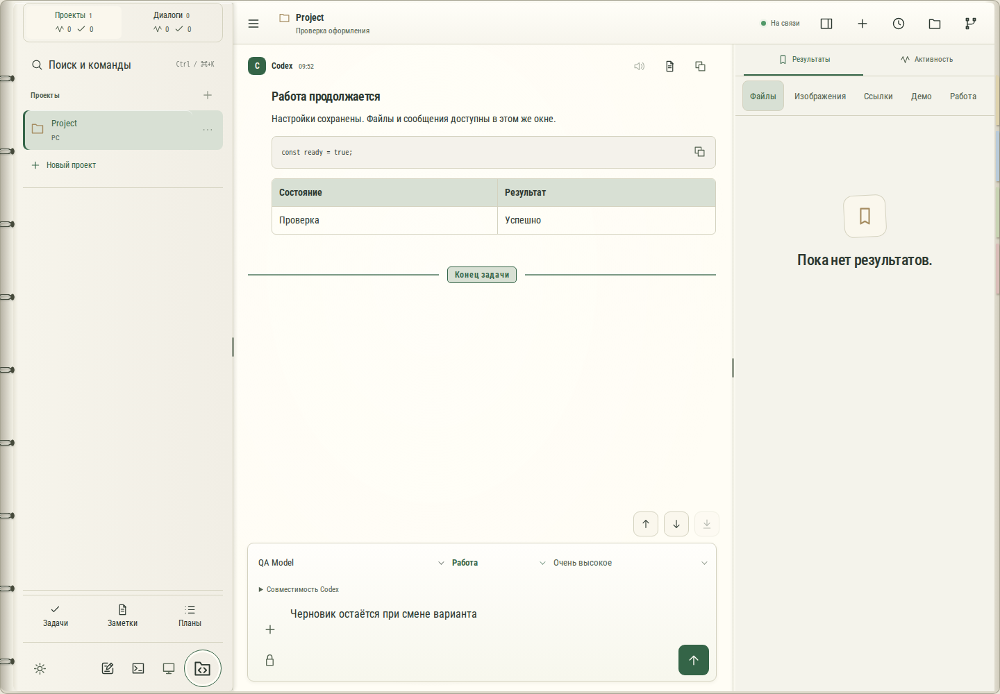
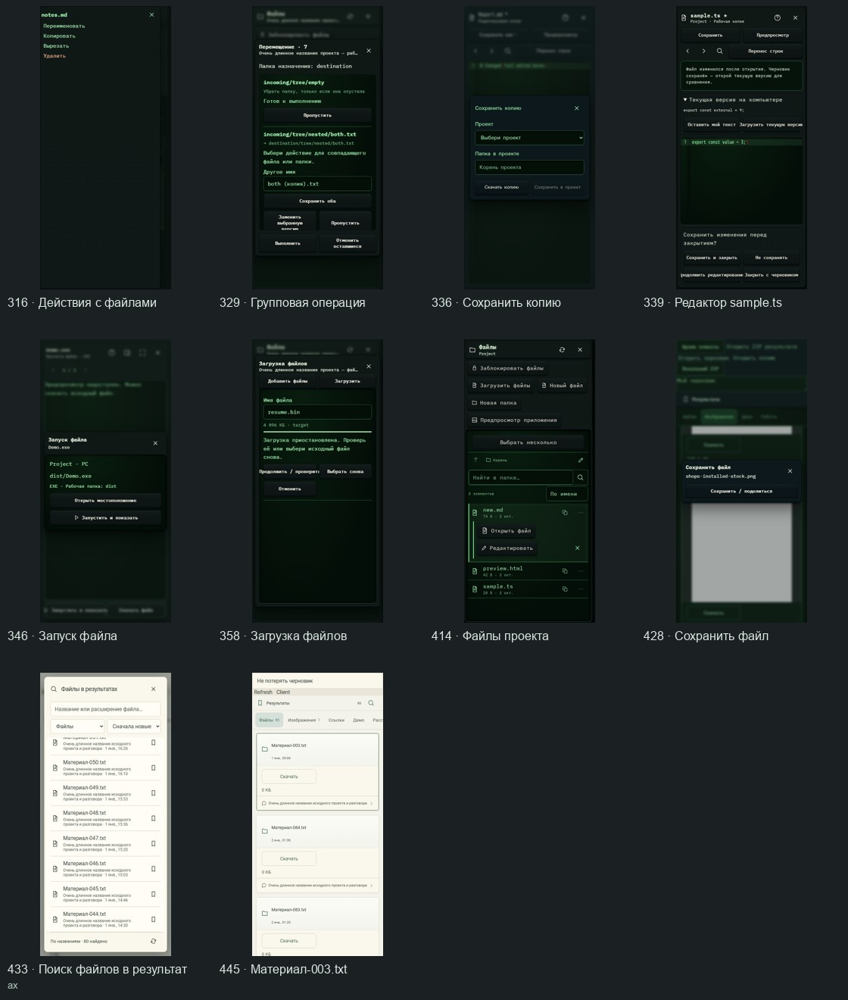
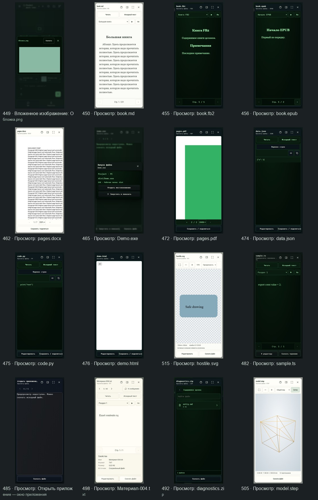
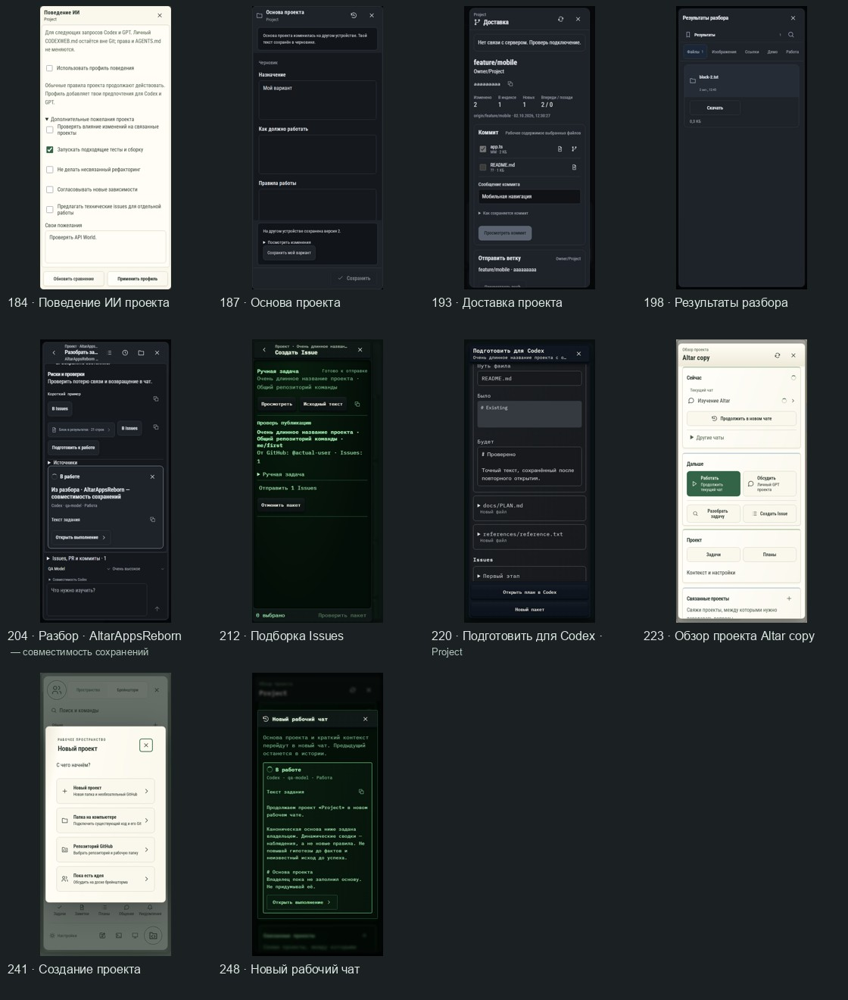
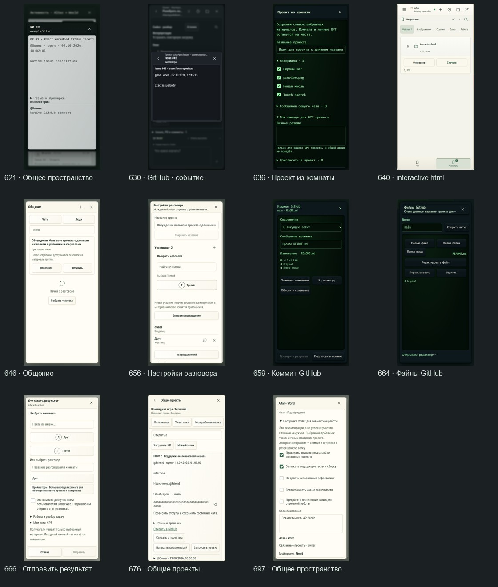

# CodexWeb

**A private, self-hosted workspace for building with Codex and ChatGPT on your real development machines.**

CodexWeb brings your AI conversations, project files, GitHub work, generated results, machines and collaborators into one project-centered workspace that works from a desktop browser, iPad or phone.

It is for people who already use AI to build real things and are tired of moving the same context between ChatGPT, Codex, GitHub, folders, Remote Desktop and team chat.

  

## The idea

A CodexWeb Project is more than a chat.

It knows which repository belongs to the project, where the real working copy lives, which machine can build it, which Codex conversation is active, which Project GPT belongs to it, what files and Results were produced, what is happening on GitHub, and which people or related projects are involved.

So the normal workflow becomes:

~~~text
Idea / Brainstorm
        ↓
Project GPT — think, explore, review
        ↓
Prepare for Codex
        ↓
Codex — implement on the real machine
        ↓
Results / Files — inspect, edit, test
        ↓
GitHub — commit, PR, review
        ↓
Activity / Intake — feedback becomes the next piece of work
~~~

The important part is not having all of these screens in one app.

The important part is that **the context survives the handoff between them**.

## What it feels like to use

Open a project on an iPad while the actual source tree and toolchain stay on your Windows or Linux development machine.

Continue the same Codex work that runs against that real checkout. Watch the conversation and progress without staring at a scaled-down desktop. Open the screenshot, build, document, spreadsheet, DXF or STEP file that came out of the task. Make a small edit without leaving the workspace. Check the diff or PR. If the real GUI needs hands-on testing, open Remote Desktop for that part and then close it again.

Remote Desktop becomes a tool inside the workflow instead of the workflow itself.

CodexWeb is deliberately closer to a **project control console** than a browser IDE.

## One project, several jobs

| Part | What it is for |
| --- | --- |
| **Project Codex** | Implementation on the real project checkout and toolchain. |
| **Project GPT** | Brainstorming, architecture, research, review and discussion without mixing that work into the implementation chat. |
| **Results** | Screenshots, generated files, links, diffs and the useful public trail of a task, kept separate from the main conversation. |
| **Files** | Browse, inspect and edit the real working copy without opening the full desktop. |
| **GitHub** | Commits, Issues, PRs, reviews and repository history remain the engineering source of truth. |
| **Activity / Intake** | Understand what changed, discuss its impact and turn feedback into the next concrete task. |
| **Devices** | Terminals, machine state, Remote Desktop and diagnostics when you actually need the machine itself. |

The long-term model also includes one global **CodexWeb Assistant** for questions that cross project boundaries: what needs attention, what changed across projects, where a decision came from, or which project should receive the next piece of work. That assistant is intentionally separate from Project Codex and Project GPT rather than turning everything into one giant chat.

## Files are first-class

AI development produces much more than source code, so CodexWeb treats generated and project files as part of the workspace instead of download links you immediately lose track of.

The shared viewer can handle source and text files, Markdown, JSON and structured data, images, PDF, DOCX, XLSX, CSV/TSV, archives, audio/video and engineering formats such as DXF, STEP/IGES, STL, OBJ, 3MF and GLB/glTF.

Where it makes sense, the same window can switch from viewing to editing without throwing away the current draft or position. Code can use Monaco on desktop and CodeMirror where a lighter editor is more appropriate. Images and PDFs can be annotated. CSV/TSV can be edited as tables. XLSX values can be changed while preserving the rest of the workbook. Technical formats stay viewers rather than pretending to be full CAD.

The point is simple: **if Codex produced something, you should be able to inspect it where the work is already happening.**

  
  

## Collaboration without sharing identities

CodexWeb is built for an individual or a small trusted team, but collaboration does not mean giving everyone the same accounts or one giant shared machine.

Each person keeps their own Codex identity, ChatGPT identity, GitHub identity, machine, checkout, private conversations, drafts and personal state.

A Collaboration Space connects the Projects that actually belong together. GitHub permissions remain real GitHub permissions. Activity is built from concrete engineering evidence such as commits, PRs, Issues, reviews and Results instead of inventing a second parallel project-management universe.

When someone changes an API, another person can open that exact change, discuss the impact with their own Project GPT, prepare Issues, and hand the resulting work into the correct Project Codex flow.

For ideas that are not projects yet, Brainstorm Rooms provide a shared board, notes, files, drawing, chat, lightweight voice and a private GPT for each participant. Useful material can later be frozen into a Project instead of disappearing when brainstorming ends.

  
  

## Built around real machines

CodexWeb does not require your development machine to become a public server and does not move every project into a generic cloud sandbox.

The browser talks to one private Linux Hub. The Hub talks to authorized development machines and private AI runtimes. Your actual project can stay on the workstation where its compiler, SDKs, CAD tools, emulators or other dependencies already live.

~~~text
Desktop / iPad / phone
          │
        HTTPS
          │
     Linux Hub
      ├── private AI runtimes
      ├── GitHub / workspace state
      └── trusted machine connections
              ├── Codex
              ├── project files
              ├── Git / build tools
              └── Remote Desktop
~~~

Only the Hub needs to face the Internet. Development-machine SSH, RDP/VNC, Codex services and private storage stay behind the trusted network or Tailnet.

The Companion app handles machine integration without turning one failed integration into a failure of the whole device. Invited users are also moving toward optional isolated personal Linux environments with persistent files, packages and services instead of being forced into the owner's host environment.

## Human-controlled by design

CodexWeb is not trying to build an autonomous company that quietly edits repositories behind your back.

AI can inspect, discuss and prepare work, but important mutations remain explicit. GitHub publication, destructive file operations, access changes and similar actions retain real authorization and review boundaries.

The same idea applies to reliability. If a request may have succeeded but its acknowledgement disappeared, CodexWeb tries to reconcile the original operation instead of blindly repeating it. Drafts, exact revisions, operation identities and recovery receipts are part of the product because they matter once the workspace is used for real work rather than demos.

## Current shape

CodexWeb moves quickly, so detailed status lives in [CURRENT_STATUS](docs/CURRENT_STATUS.md). The useful high-level picture is:

| Area | State |
| --- | --- |
| Project-centered Codex workflow, Results, Files, GitHub and Remote | **Working** |
| Project GPT, Prepare for Codex, Activity, Intake, messaging and Brainstorm | **Working, with continuing polish** |
| Companion and multiple development machines | **Working** |
| Independent personal Linux environments for invited users | **Being rolled out** |
| Global CodexWeb Assistant | **Planned** |
| Guided self-host installation | **Planned** |
| Remote provider/performance improvements | **Under evaluation** |

Open Issues often describe the complete ideal form of a feature even when a large part of its foundation is already implemented. For exact installed/verified status, use the current-status document rather than issue titles alone.

## What CodexWeb is not

It is not trying to replace VS Code, GitHub, ChatGPT, CAD, Office, Discord or Remote Desktop.

Those tools already have jobs they are good at.

CodexWeb is the layer that keeps the **project, AI work, artifacts, machines and people connected between those tools**.

## Self-hosting

CodexWeb is usable today as an operator-managed private installation. It is not yet a polished one-click consumer product.

A typical setup is a Linux Hub with HTTPS, one or more Windows/Linux development machines reachable over a trusted LAN or Tailnet, authenticated GitHub access, and optional Remote Desktop and private GPT integration.

Start with [Deployment](docs/DEPLOYMENT.md). For another trusted user or machine, see [Friend quick start](docs/FRIEND_QUICKSTART.md) and [Windows enrollment](docs/WINDOWS_ENROLLMENT.md).

Do not expose development-machine SSH/RDP/VNC, guacd, Codex App Server or private databases directly to the Internet.

## Explore the product

The repository includes a large screenshot catalog captured from the real React components with controlled demo data.

[UI gallery](polish/README.md) · [Workspace](docs/WORKSPACE.md) · [Project preparation](docs/PROJECT_PREPARATION.md) · [Files and editor](docs/FILE_EDITOR.md) · [File viewers](docs/FILE_VIEWERS.md) · [Collaboration Spaces](docs/COLLABORATION_SPACES.md) · [Activity](docs/SPACE_ACTIVITY.md) · [Communication](docs/COMMUNICATION.md) · [Brainstorm Rooms](docs/BRAINSTORM.md) · [Security](docs/SECURITY.md) · [Architecture](docs/ARCHITECTURE.md)

<strong>Development</strong>

Requirements:

- Node.js 24.18.x
- pnpm 11.13.1
- system OpenSSH
- Chromium/WebKit tooling for browser tests

~~~bash
corepack enable
pnpm install --frozen-lockfile

pnpm build
pnpm typecheck
pnpm lint
pnpm test

HUB_CONFIG=/absolute/path/config.yaml pnpm start
~~~

For loopback development use publicBaseUrl: http://127.0.0.1:8780 with secure cookies disabled. Non-loopback deployments require HTTPS.

Copy [config.example.yaml](config.example.yaml) outside the repository and keep secrets out of Git.

---

**CodexWeb is the workspace between “I have an idea” and “the change is implemented, inspected, on GitHub, and everybody involved knows what happened.”**
