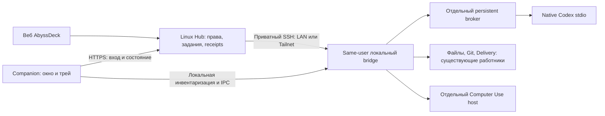

# Companion: универсальное приложение Windows

## Уточнение роли, 3 октября 2026

Companion отвечает за работу подключённого устройства в целом: связь, файлы,
терминал, сервисы, обновления и восстановление. Codex является одной из его
необязательных возможностей. Его отсутствие или необходимость входа не должны
блокировать готовые файловые/терминальные функции и пользовательские службы.
Состояние и восстановление разделяются по возможностям, а не сводятся к одному
индикатору исправности Codex. Существующие LAN-привязки Windows сохраняются.

Тот же контракт распространяется на новый личный Linux на сервере. Серверные
службы и SSH/SFTP через Tailscale работают независимо от Hub, чатов и личного ПК.
Графический Companion внутри каждого гостя не требуется; используется серверный
адаптер. Подробности и границы реализации: [PERSONAL_LINUX.md](PERSONAL_LINUX.md).
Это новая утверждённая роль, не утверждение об уже установленном Linux-адаптере.

Согласованный проект, 30 сентября 2026. Первый Windows UI/трей реализован;
[сборка и доступное поведение](COMPANION_APP_BUILD.md). Остальные разделы ниже —
проект следующих этапов. В исходниках 0.3.0 реализован вход/мастер/ручной ремонт,
в 0.4 — подписанный UI updater и ограниченное восстановление вспомогательных tasks.
Активация и установка фиксируются отдельно в CURRENT_STATUS. Переход
исполнителей остаётся будущим этапом.
Текущее состояние установки находится в [плане миграции](COMPANION_APP_MIGRATION.md).

## Решение владельца

Один пакет для владельца, администраторов и участников. Возможности определяет
аккаунт Hub; отдельной «админской сборки» нет. Сейчас Windows важнее, поскольку
владелец и друг продолжают пользоваться им. Архитектура сохраняет возможность
Linux-клиента и существующие серверные рабочие пространства.

Приложение постоянно доступно из трея: подключение, настройка, состояние нужных
компонентов, автоматическое восстановление и обновления. Пользователи,
приглашения и управление Hub остаются в существующем вебе — владелец подтвердил
это в текущем обсуждении. Companion показывает доступное состояние Hub и открывает
его администрирование; сервер повторно проверяет права.

Текущий ПК владельца получает сохранённую конфигурацию и привязку. Переустановка
аккаунтов, проектов, ключей и принудительное прохождение мастера участника не нужны.
Перед каждым следующим заходом рекомендуются **модель и уровень размышлений**;
работа начинается после «Продолжаем».

## Окно и трей

| Раздел | Пользовательский результат |
| --- | --- |
| Обзор | Этот компьютер, выбранный Hub/аккаунт, готовые возможности и необходимые действия |
| Подключение | Вход через Hub, точная привязка ПК, текущий маршрут LAN/Tailnet |
| Компоненты | Codex, файлы/терминал, Git/GitHub, Computer Use; необязательный Remote отдельно |
| Обновления | Установленная/доступная версия, подготовка, ожидание окончания работы, результат |
| Настройки | Автозапуск, уведомления, рабочие каталоги, ограниченный диагностический отчёт |

В трее доступны «Открыть», «Открыть AbyssDeck», «Проверить состояние», «Обновления»,
«Приостановить новые задания» и «Выход». Значок имеет краткую текстовую подсказку;
цвет не является единственным объяснением. Обычный успешный опрос не создаёт
уведомление. Число выполняющихся заданий не раскрывает содержимое чатов.

Крестик скрывает окно в трей. Выход из интерфейса и отключение компьютера — разные
действия: интерфейс можно закрыть без завершения работников. Отключение сначала
закрывает приём новых заданий и ждёт окончания принятых. Оно не прерывает их
автоматически. Приостановка также не отменяет уже принятый ввод или native-ответ.
Все формы сохраняют локальный черновик при скрытии окна и подготовке обновления.

В первой версии один активный профиль Hub/аккаунта на интерактивную Windows-сессию.
Смена профиля проверяет окончание/передачу текущей работы и очищает прошлые
возможности; невозможно незаметно использовать старый ПК от имени нового аккаунта.

Общие принципы тем, подписей и явных рядов действий сохраняются из
[UI_LAYOUT_RULES.md](UI_LAYOUT_RULES.md). Не переносим весь веб в ещё одно окно.

## Техническое устройство

Предлагаемый стек — C# и Avalonia, с автономным пакетом .NET, без требования
устанавливать SDK на ПК пользователя. [Avalonia поддерживает Windows 10 build
19045 на уровне Tier 2](https://docs.avaloniaui.net/docs/supported-platforms),
а [TrayIcon](https://docs.avaloniaui.net/controls/navigation/trayicon/) предоставляет
нативный трей. Поэтому первая реализация начинается с проверки реального
Windows 10 Home владельца, DPI, клавиатуры, трея и упаковки. Версия framework/runtime
фиксируется после этой проверки, а не по наличию старого SDK на машине.

Для нового пакета предпочтителен актуальный LTS runtime; текущие .NET 8/9 не
делаем зависимостью установки. [Политика поддержки .NET](https://dotnet.microsoft.com/en-us/platform/support/policy/dotnet-core)
возлагает обновление встроенного runtime на издателя автономного приложения.
Документированная поддержка ОС и успешный запуск на фактическом ПК проверяются
отдельно. Linux-перенос и особенности трея разных окружений не объявляются готовыми.



UI, управление жизненным циклом и исполнители — отдельные процессы. Native Job
Objects остаются у broker, не у окна/трея. Перезапуск UI не завершает native-ход.
Это **не обещает** сохранения процесса при падении самого broker: такая потеря
остаётся неопределённой операцией с существующим receipt, без повторной отправки.

Первое окно подхватывает существующие задачи **только для чтения**. Оно не создаёт
второго writer и не переподключает controller ради индикатора готовности. Перенос
управления исполнителями выполняется позже при подтверждённом простое.

Всё работает под тем же Windows SID в пользовательской сессии, обычно Limited.
Не вводим службу Session 0 вместо интерактивного Computer Use. Существующая
привилегированная задача перезапуска desktop остаётся отдельной ограниченной
операцией. GUI сохраняет обычный доступ к приложениям владельца без allowlist,
наблюдение перед действием и проверку после него.

## Аккаунт, права и маршруты

Профиль содержит Hub origin/identity, числовую identity аккаунта, device ID,
Windows SID/machine identity и выбранный транспорт. Роль Hub и разрешение Windows
на повышение прав независимы. Администратор Hub не получает чужие личные чаты,
credentials или машины. Название сборки и локальный флаг `admin` прав не дают.

Предлагаемый новый вход: короткий одноразовый запрос привязки ПК, подтверждаемый
через существующий браузерный вход Hub. Companion получает ограниченный
device credential через исходящий HTTPS, хранит его через DPAPI текущего
пользователя и ACL. Нужны срок действия, отзыв, обновление и проверка exact
account/device binding. Такой general-purpose контракт **сейчас отсутствует**:
одноразовый enrollment report и `/api/team/me` его не заменяют.

Не добавляем сетевой listener на Windows или localhost callback server. Пароли
не вводятся в чат и не копируются из браузера. Native Codex/GitHub используют
свои логины текущего пользователя; GPT-профиль остаётся приватным на Hub.

Для владельца автоматически подставляются существующие Hub URL, `main-windows`,
LAN-маршрут и рабочие каталоги. Авторизованная серверная миграционная привязка
должна подтвердить текущего владельца/ПК; локальное имя EriArk не является
доказательством прав. Это не новая регистрация и не новая SSH-пара ключей.

Участник подключается к публичному Hub по HTTPS, а исполнение идёт по приватному
Hub → Tailnet SSH → Companion. Существующее приглашение, pinned host key,
проверка числового GitHub identity и явная активация ПК сохраняются. Статус
«Tailscale включён» недостаточен: нужен действительный доступ к нужному Hub.
Владелец сохраняет прямой LAN SSH; общая программа не навязывает ему Tailnet.
Другой аккаунт/ПК никогда не становится запасным маршрутом.

## Первый запуск: вход, галочки и автоматическая настройка

Уточнение владельца 30 сентября: один мастер в приложении, пригодный для отправки
другу. Сначала вход в точный Hub account через существующий браузерный вход;
затем привязка своего ПК и общий список компонентов. Это проект следующего
этапа: установленный UI 0.2.0 пока не содержит этого мастера.

1. **Войти в Hub.** Приложение показывает адрес сервера и кнопку входа. Короткая
   одноразовая привязка подтверждает аккаунт/ПК; данные входа остаются у владельца
   аккаунта. Истечение/отзыв привязки возвращает на этот шаг, сохраняя подготовку.
2. **Показать список готовности.** После входа серверные возможности и выбранный
   маршрут определяют нужные компоненты. Уже исправные получают ✓. Для остальных
   видны «Устанавливается», «Настраивается», «Нужен вход» или конкретная ошибка
   с «Исправить». Прогресс остаётся видимым до фактического окончания шага.
3. **Подготовить автоматически.** Мастер проходит зависимости по порядку:
   выбранный LAN/Tailnet-маршрут, SSH, runtime/broker, файлы/терминал, требуемые
   инструменты и GUI-модули. Существующее исправное используется; отсутствующее
   устанавливается из проверенного совместимого пакета и настраивается для того
   же пользователя. SDK не требуется. Legacy compatibility нужен только там,
   где он является подтверждённой зависимостью; не создавать второго writer.
4. **Завершить личные шаги.** Кнопки входа в Codex, GitHub, Tailscale или настройки
   GPT появляются только для выбранной возможности. После личного входа мастер
   проверяет готовность и продолжает автоматически. Выбор рабочих папок,
   optional-модулей и Windows elevation — отдельные понятные действия. Ожидание
   одобрения доступа в вебе показывается как ожидание, не как падение мастера.
5. **Подтвердить готовность.** Галочка выдаётся по фактической проверке результата,
   включая Hub → private SSH → установленный Companion и собственный native
   account. «Готово» не означает только удачный exit code установщика. В финале —
   «Открыть AbyssDeck», краткая инструкция и тот же список для будущего ремонта.

Текущий owner ПК сначала подхватывает исправную конфигурацию: LAN SSH, roots,
accounts и receipts сохраняются. Ни повторный мастер, ни общий пакет для друга
не заставляют владельца заводить новые аккаунты/ключи или переходить на Tailnet.
Пакет содержит общую программу/публичный Hub origin, не чужие private credentials,
SID, проекты или встроенную роль администратора. Возможности берутся из Hub.

### Возобновление и ремонт

Сохраняется отдельный checkpoint каждого компонента: exact account/device/SID,
версия/хеш пакета, состояние и operation receipt. Закрытие окна, потеря сети,
ошибка скачивания или перезапуск продолжают с незавершённого места. Принятый шаг
с потерянным подтверждением сначала сверяется с реальной установкой/Hub receipt;
новый install/send/input не воспроизводится вслепую. Переход в другой аккаунт
не заимствует прежний checkpoint или его разрешения.

Кнопка «Исправить» использует тот же конкретный шаг подготовки, что и мастер.
Ошибка одной optional-возможности не блокирует уже готовые основные возможности.
После завершения мастер не исчезает навсегда: checklist доступен в «Компонентах»,
а незавершённые личные действия можно продолжить оттуда.

### Входы, команды и инструкция

У нужного шага есть тематические кнопки «Войти», «Открыть терминал» и действие
с понятной командой. Терминал привязан к этому пользователю/устройству; до
готовности SSH настройка использует локальный терминал Companion в той же
Windows-сессии, без сетевого listener. Доступный веб-терминал открывается через
существующий exact-device Devices flow. URL не выполняет команду.

Ввод команды и отдельный маскированный ввод пароля сохраняют «Вставить» и
отдельную отправку. Пароль идёт только в действующий prompt; он не попадает в
чат, setup checkpoint, настройки, clipboard history приложения или лог.
Скрытие/переподключение не повторяет терминальный ввод. По запросу пользователя
Computer Use может выполнять обычный вход в приложения, включая поля пароля
и кнопку входа; это не требует доступа к хранилищу native credentials.
Для личных секретов доступен прямой ввод пользователем: обычные MCP arguments
могут сохраняться в истории разговора. Credentials других аккаунтов не копируются.
Сам wizard пока не реализован; его шаги личного входа не выполняются без запроса.

Встроенная инструкция объясняет каждый компонент, смысл галочки и ожидания,
первый вход, выбор папок, терминал/пароли, продолжение настройки и ремонт.
Отдельная короткая памятка в пакете для друга: открыть Companion → войти в Hub →
дождаться checklist → завершить предложенные личные входы → открыть AbyssDeck.
В неё включаются только работающие действия; текст согласуется с веб-справкой.

## Готовность и восстановление

### Уточнение владельца: галочки и ручной ремонт (30 сентября)

У исправных компонентов — видимая тематическая галочка и понятная подпись;
цвет не является единственным признаком. «Готов по запросу» тоже исправно.
«Занято» сохраняет готовность и не предлагает перезапуск. «Проверяется» показывает
индикатор до окончания проверки. Выключенный optional-компонент и неизвестное
состояние не получают ложную галочку. У Hub отдельное такое же отображение.

При неисправности у конкретного компонента есть «Исправить». Это вход в реальное
восстановление именно этой причины, не переименованная проверка и не общая
переустановка всего ПК. Кнопка заранее показывает, что будет сделано и чего
не хватает для выполнения. После исправления повторно проверяется результат;
неподтверждённая операция не объявляется успешной.

| Причина | Действие ремонта |
| --- | --- |
| Неверный/отсутствующий адрес Hub | Исправление адреса с сохранением профиля; проверка точного Hub |
| Потеря связи | Восстановление чтения; настройки подключения, если нужна ручная правка; нет отправки сообщений |
| Остановлен подтверждённый собственный компонент | Запуск выбранной существующей задачи после свежей проверки identity, task/module и admission; работающие задачи не перезапускаются |
| Отсутствует/повреждён файл компонента | Восстановление его из проверенного совместимого пакета с backup/rollback; без сброса accounts, roots и receipts |
| Компонент явно выключен | Отдельное явное включение, если capability и права подтверждены; не автоматический запуск optional-компонента |
| Неизвестная/чужая задача, неверная привязка или нет прав | Вход/привязка через точный Hub, затем свежая проверка; нет ремонта чужого пользователя |
| Компьютер заблокирован или требует Windows-действия | Конкретный шаг пользователя; нет ложного обещания исправить secure desktop |

Ручной ремонт включён в следующий этап входа/мастера: Hub account permissions
и device binding проверяются до изменения компонентов. Действия имеют exact
component identity и durable receipt; двойной клик, потеря подтверждения и
переподключение не повторяют эффект. В 0.3.0 добавлены галочки подтверждённой
готовности, ручное включение/запуск остановленного собственного модуля и
восстановление файлов вспомогательных модулей из фиксированного пакета Hub.
Описание задачи повторно сверяется перед изменением. Сам native writer не
переустанавливается этим путём; переход исполнителя остаётся отдельным этапом.
Автоматическое восстановление и signed auto-update остаются последующим этапом.

| Возможность | Проверяется | Что не должно её блокировать |
| --- | --- | --- |
| Codex | Broker/stdio, полный CLI bundle, native account, модели/протокол | Необязательные GUI/Remote/GitHub |
| Файлы и терминал | Точная машина, SSH/IPC, доступ к выбранным каталогам | Выполняющийся Codex; нет общего idle guard на ручные файлы |
| GitHub | Git/GH, собственный numeric account, нужный worker | Работа без GitHub |
| Computer Use | Same SID, интерактивная разблокированная сессия, host/launcher | Состояние desktop Codex |
| GPT | Собственный профиль и connector на Hub | Windows desktop ChatGPT |
| Remote | Только выбранный необязательный provider | Остальные возможности |

Состояния: проверяется, готово, занято, требуется действие, недоступно,
неизвестно, выключено. Evidence содержит identity generation, время и срок
актуальности. «Занято» не является ошибкой. Отсутствие свежего ответа не означает,
что принятое сообщение не было отправлено.

Переиспользуем `machineHealth.ts`, Doctor и имеющиеся receipts. Частые проверки
используют сохранённые сведения и пассивный IPC; полноценный App Server probe
проводится по запросу, после смены версии или с ограниченной периодичностью.
Один выполняющийся probe на компонент/identity; новый tick его не отменяет.
Возврат окна, восстановление сети и изменение версии запускают объединённое
обновление. Старый ответ не меняет новый профиль.

Допустимое автоматическое восстановление — переподключение чтения и запуск
известного остановленного собственного idle-модуля. Предлагаемые начальные
интервалы: 10/30/120 секунд, затем 15 минут охлаждения; это параметры реализации,
а не уже установленное поведение. Принятый ввод, uncertain send, GUI-действие и
команды терминала не воспроизводятся. Native receipts не очищаются после
восстановления здоровья. Работающий процесс не перезапускается ради диагностики.

## Обновления

Стабильный launcher выбирает проверенную immutable release. UI, broker, CUA,
CLI и workers имеют отдельные версии и совместимые диапазоны протоколов.
Обновление optional CUA не перезапускает основной Companion или активный чат.

Manifest содержит release/component IDs, хеши, размеры, платформу/архитектуру,
минимальную ОС, диапазоны протоколов и схем. Нужна подпись release доверенным
ключом издателя, закреплённым при проверенной первоначальной установке. В UI 0.4
ключ создан/защищён и подпись проверяется; ротация остаётся отдельной операцией;
одного хеша из произвольного URL недостаточно для автоустановки кода.

```text
check → download → verify → stage → wait_idle → activate → validate → committed
                                     ↑                         |
                          активная/неизвестная работа           ↓
                                                   rollback до admission
```

UI проверяет выпуск при старте и раз в шесть часов, не чаще раза в десять
минут после временной ошибки. Ручная проверка доступна всегда. UI обновляется
независимо после завершения ввода/настройки, с сохранением страницы и прокрутки.
Перед заменой broker/CLI: закрыть новый admission, получить точную lease, проверить
отсутствие активных/неопределённых native операций и заново сверить identities.
При неизвестном состоянии ждём; по умолчанию forced update нет.

Сборка Windows явно включает SelfContained и PublishSelfContained. До упаковки
готовый exe запускается с `--version`: наличие DLL и совпадение хешей сами по себе
не доказывают работоспособность runtime. Неудавшийся запуск запрещает публикацию.

После переключения — version/hash/protocol/account/model checks по настоящему
Hub → SSH → установленному Companion. До открытия admission неудачная версия
откатывается на сохранённый пакет/config/task definitions. Старые runtime остаются
для текущих клиентов. Не восстанавливаем старую БД поверх новых записей.

Desktop-обновление может переместить `codex.exe`. Поиск кандидата учитывает полный
bundle, версию, хеши, initialize и account/model evidence, а не только mtime.
Явно настроенный пользовательский CLI не заменяется автоматически desktop-копией.
Hub fallback metadata и фактический launcher должны согласовываться в одной
проверенной активации. Это устраняет причину повторяющейся поломки пути.

## Последующие законченные заходы

1. **Окно/трей и подхват нынешнего ПК — реализовано.** Compatibility spike, автономный Windows
   пакет, пользовательский автозапуск, overview/read-only inventory всех девяти
   задач, сохранение настроек, независимость UI от native процессов. Без замены
   текущих workers. Следующая предлагаемая работа: GPT‑6.1 Sol, Высокое (`high`).
2. **Вход и мастер участника — реализовано в исходниках 0.3.0.** Scoped device pairing/roles, преднастройка владельца,
   resumable enrollment, LAN/Tailnet readiness, собственные логины и web-admin entry.
   Галочки исправности и ручное восстановление конкретного компонента по
   описанному выше контракту, с повторной проверкой результата.
   Один реальный путь установки вместо набора несвязанных ручных шагов.
3. **Восстановление и подписанное обновление UI — исходники 0.4.0 готовы.**
   Bounded recovery, подписанный manifest/архив, exact file inventory,
   immutable activation/rollback и bundled helper repair kit. Фактические
   установка/активация отражаются в CURRENT_STATUS.md. Native writer/broker/CLI
   не заменяются этим updater; их совместимость и переход входят в пункт 4.
4. **Контролируемый переход и приёмка.** Idle adoption исполнителей на ПК владельца,
   откат, проверка реального маршрута и установка на независимом ПК друга. Linux
   frontend остаётся последующим отдельным переносом.

Каждый заход включает связанную реализацию, точечную проверку, справку и интеграцию
в `main`. Source completion, installation и приёмка обозначаются отдельно.
Автотесты не требуют остановки этого чата; настоящая работа пользователя не
используется как экспериментальная отправка.
