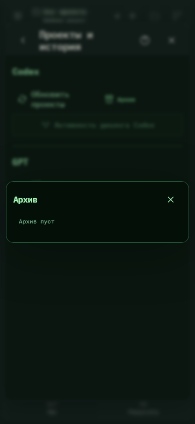

# 002. Архив

**Телефон · 393 × 852 · тема `crt-green`.**

Поиск архивных проектов/чатов и возврат их в основной список.

**Как открыть:** Настройки → Проекты и история → Архив.

**Снято после:** Разархивировать. Рабочее состояние.

Вложенное окно поверх сохранённого родительского экрана. Затемнение и видимые края родителя входят в снимок.

**Действия:** «Закрыть архив».

**Для обсуждения:** Достаточно ли понятно различие архива и удаления? Удобно ли восстанавливать несколько объектов?

Снимок фиксирует вид интерфейса. Данные демонстрационные; ошибки, ожидания и конфликты могли быть созданы сценарием. Это не подтверждение состояния рабочего сервера или реальных интеграций.

**Источник:** [EntityMenu.tsx](../../apps/web/src/EntityMenu.tsx). Сценарий `polish-extra.mjs`; код `56214b0`, 2026-10-02. Chromium; размер окна эмулируется, это не физический iPhone.

[Другой размер](002-desktop.md) · [Раздел](README.md) · [Весь каталог](../README.md)
