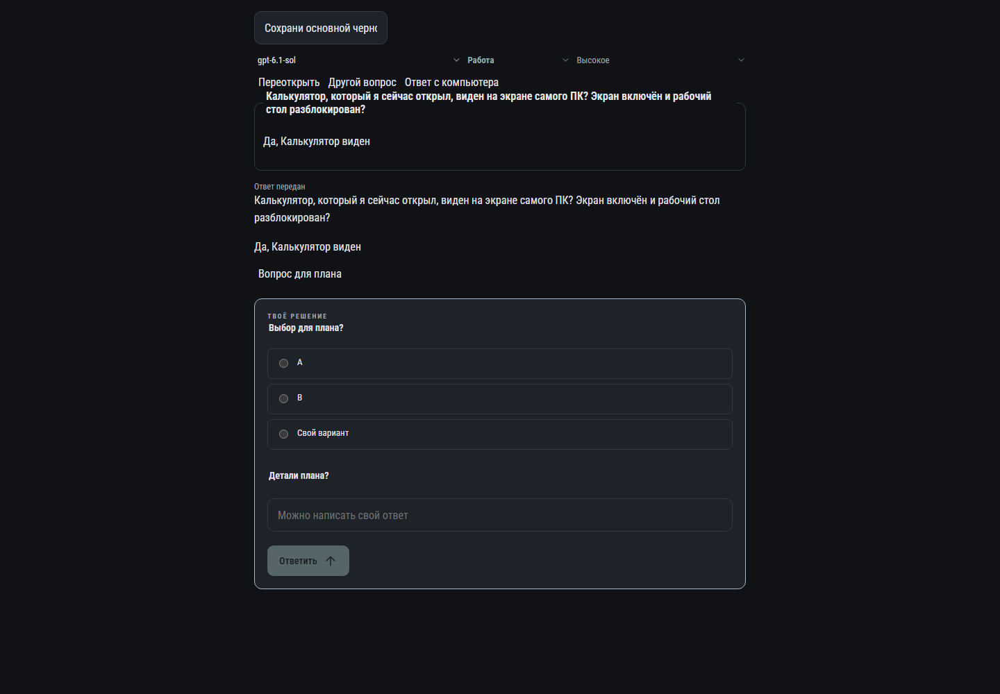

# 008. Рабочая область

**Широкий экран · 1440 × 1000 · тема `classic-dark`.**

Основной рабочий чат Codex с сообщениями, действиями и состояниями работы.

**Как открыть:** Выбор проекта и диалога.

**Снято после:** Вопрос для плана. Рабочее состояние.

Компонент открыт в изолированном стенде. Демонстрационный фон и кнопки запуска вне окна не являются отдельным экраном продукта.

**Действия:** «Переоткрыть»; «Другой вопрос»; «Ответ с компьютера»; «Вопрос для плана»; «Ответить».

**Поля и параметры:** «Черновик сообщения»; «Модель Codex»; «Режим Codex»; «Уровень размышления»; «A»; «B»; «Свой вариант»; «Свой ответ: Детали плана?».

**Для обсуждения:** Понятны ли текущее состояние, очередь сообщений и завершение работы? Какие действия должны оставаться под рукой?

Снимок фиксирует вид интерфейса. Данные демонстрационные; ошибки, ожидания и конфликты могли быть созданы сценарием. Это не подтверждение состояния рабочего сервера или реальных интеграций.

**Источник:** [App.tsx](../../apps/web/src/App.tsx). Сценарий `codex-questions`; код `56214b0`, 2026-10-02. Chromium; размер окна эмулируется, это не физический iPhone.

[Другой размер](008-phone.md) · [Раздел](README.md) · [Весь каталог](../README.md)
