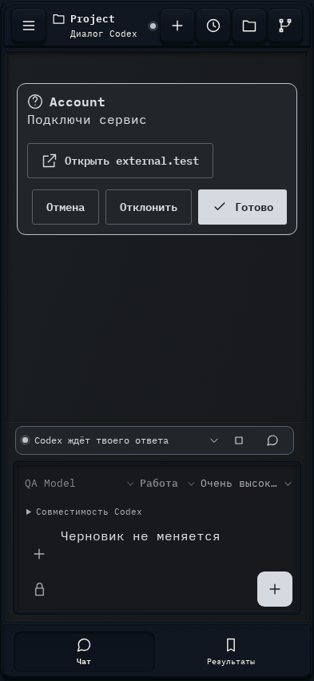

# 019. Пока нет результатов.

**Телефон · 393 × 852 · тема `crt-green`.**

Основной рабочий чат Codex с сообщениями, действиями и состояниями работы.

**Как открыть:** Выбор проекта и диалога.

**Снято после:** Запрос Account. Рабочее состояние.

**Действия:** «Отмена»; «Отклонить»; «Готово»; «Ход работы»; «Остановить Codex»; «К вопросу»; «Добавить файлы или изображения»; «Добавить в очередь»; «Результаты»; «Активность»; «Файлы»; «Изображения»; «Ссылки»; «Демо»; дополнительные действия в прокручиваемой области.

**Поля и параметры:** «Модель Codex»; «Режим Codex»; «Уровень размышления»; «Доступ Codex»; «Сообщение Codex».

**Для обсуждения:** Понятны ли текущее состояние, очередь сообщений и завершение работы? Какие действия должны оставаться под рукой?

Снимок фиксирует вид интерфейса. Данные демонстрационные; ошибки, ожидания и конфликты могли быть созданы сценарием. Это не подтверждение состояния рабочего сервера или реальных интеграций.

**Источник:** [App.tsx](../../apps/web/src/App.tsx). Сценарий `elicitation`; код `56214b0`, 2026-10-02. Chromium; размер окна эмулируется, это не физический iPhone.

[Другой размер](019-desktop.md) · [Раздел](README.md) · [Весь каталог](../README.md)
