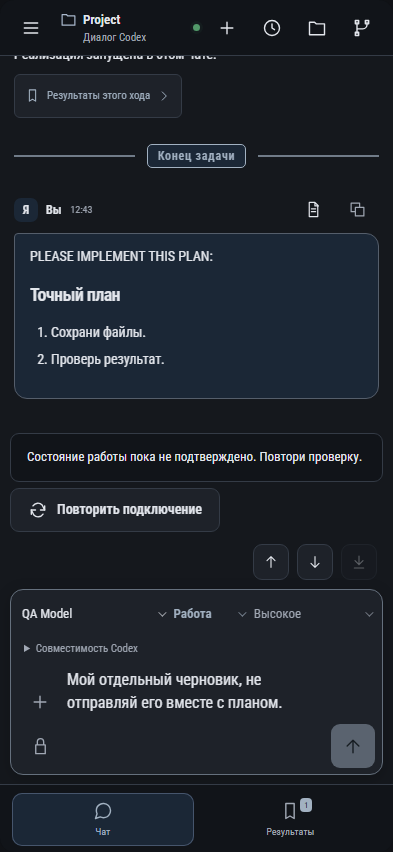

# 032. Точный план

**Телефон · 393 × 852 · тема `classic-dark`.**

Основной рабочий чат Codex с сообщениями, действиями и состояниями работы.

**Как открыть:** Выбор проекта и диалога.

**Снято после:** Проверить запуск. Сообщение об ошибке или проверке.

**Действия:** «Сохранить в заметки»; «Копировать сообщение»; «Озвучить ответ»; «Результаты этого хода»; «Повторить подключение»; «Предыдущее сообщение»; «Следующее сообщение»; «В конец чата»; «Добавить файлы или изображения»; «Отправить сообщение»; «Результаты1»; «Активность»; «Файлы»; «Изображения»; дополнительные действия в прокручиваемой области.

**Поля и параметры:** «Модель Codex»; «Режим Codex»; «Уровень размышления»; «Доступ Codex»; «Сообщение Codex».

**Для обсуждения:** Понятны ли текущее состояние, очередь сообщений и завершение работы? Какие действия должны оставаться под рукой?

Снимок фиксирует вид интерфейса. Данные демонстрационные; ошибки, ожидания и конфликты могли быть созданы сценарием. Это не подтверждение состояния рабочего сервера или реальных интеграций.

**Источник:** [App.tsx](../../apps/web/src/App.tsx). Сценарий `native-plan`; код `56214b0`, 2026-10-02. Chromium; размер окна эмулируется, это не физический iPhone.

[Другой размер](032-desktop.md) · [Раздел](README.md) · [Весь каталог](../README.md)
