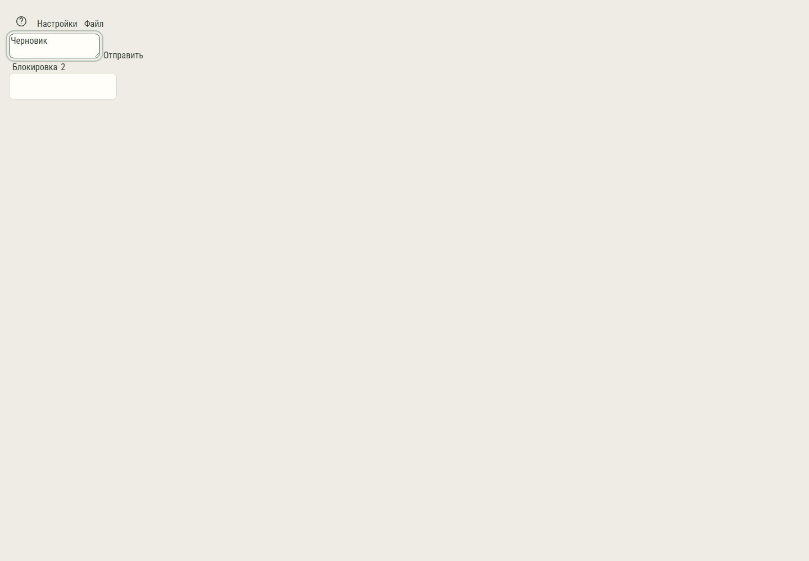

# 053. Рабочая область

**Широкий экран · 1440 × 1000 · тема `по умолчанию`.**

Основной рабочий чат Codex с сообщениями, действиями и состояниями работы.

**Как открыть:** Выбор проекта и диалога.

**Снято после:** Сообщение. Рабочее состояние.

**Действия:** «Справка и клавиши»; «Настройки»; «Файл»; «Отправить»; «Блокировка».

**Поля и параметры:** «Сообщение»; «Терминал».

**Для обсуждения:** Понятны ли текущее состояние, очередь сообщений и завершение работы? Какие действия должны оставаться под рукой?

Снимок фиксирует вид интерфейса. Данные демонстрационные; ошибки, ожидания и конфликты могли быть созданы сценарием. Это не подтверждение состояния рабочего сервера или реальных интеграций.

**Источник:** [App.tsx](../../apps/web/src/App.tsx). Сценарий `workspace-help`; код `56214b0`, 2026-10-02. Chromium; размер окна эмулируется, это не физический iPhone.

[Другой размер](053-phone.md) · [Раздел](README.md) · [Весь каталог](../README.md)
