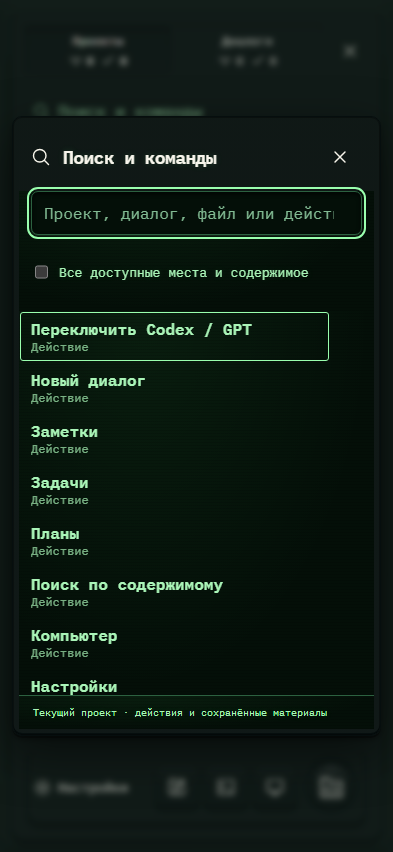

# 054. Поиск и команды

**Телефон · 393 × 852 · тема `crt-green`.**

Быстрый переход к месту, материалу или действию через единый поиск.

**Как открыть:** Меню → Поиск и команды; Ctrl/⌘+K.

**Снято после:** Открытое состояние. Рабочее состояние.

Вложенное окно поверх сохранённого родительского экрана. Затемнение и видимые края родителя входят в снимок.

**Действия:** «Закрыть поиск и команды»; «Переключить Codex / GPTДействие»; «Новый диалогДействие»; «ЗаметкиДействие»; «ЗадачиДействие»; «ПланыДействие»; «Поиск по содержимомуДействие»; «КомпьютерДействие»; «НастройкиДействие»; «СправкаДействие».

**Поля и параметры:** «Найти место или действие»; «Все доступные места и содержимое».

**Для обсуждения:** Понятна ли область поиска? Достаточно ли заметны тип результата и сочетания клавиш?

Снимок фиксирует вид интерфейса. Данные демонстрационные; ошибки, ожидания и конфликты могли быть созданы сценарием. Это не подтверждение состояния рабочего сервера или реальных интеграций.

**Источник:** [WorkspaceCommands.tsx](../../apps/web/src/WorkspaceCommands.tsx). Сценарий `polish-extra.mjs`; код `56214b0`, 2026-10-02. Chromium; размер окна эмулируется, это не физический iPhone.

[Другой размер](054-desktop.md) · [Раздел](README.md) · [Весь каталог](../README.md)
