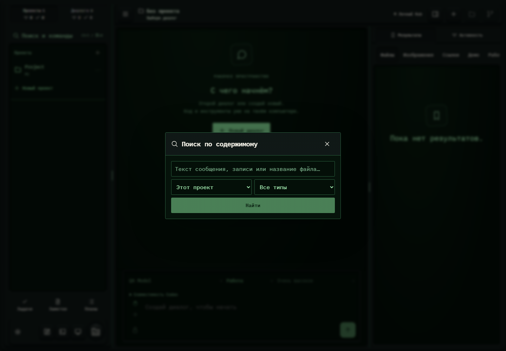

# 055. Поиск по содержимому

**Широкий экран · 1440 × 1000 · тема `crt-green`.**

Поиск внутри сообщений, записей, планов и файлов с ограничением области.

**Как открыть:** Поиск и команды → Поиск по содержимому.

**Снято после:** Открытое состояние. Рабочее состояние.

**Действия:** «Закрыть поиск»; «Найти».

**Поля и параметры:** «Искать в тексте»; «Где искать»; «Что искать».

**Для обсуждения:** Нужны ли отдельные фильтры в таком количестве? Как показывать пустую выдачу и точное место найденного фрагмента?

Снимок фиксирует вид интерфейса. Данные демонстрационные; ошибки, ожидания и конфликты могли быть созданы сценарием. Это не подтверждение состояния рабочего сервера или реальных интеграций.

**Источник:** [ContentSearch.tsx](../../apps/web/src/ContentSearch.tsx). Сценарий `polish-extra.mjs`; код `56214b0`, 2026-10-02. Chromium; размер окна эмулируется, это не физический iPhone.

[Другой размер](055-phone.md) · [Раздел](README.md) · [Весь каталог](../README.md)
