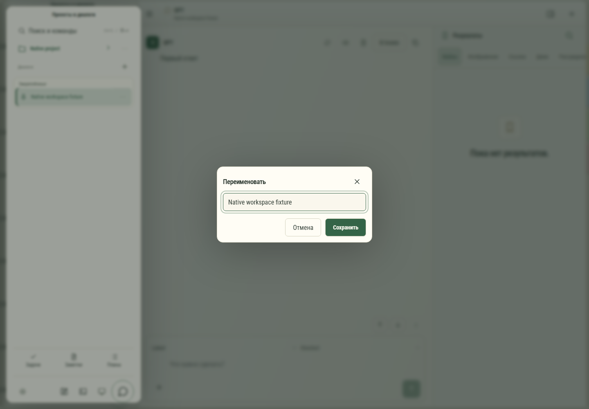

# 056. Переименовать

**Широкий экран · 1440 × 1000 · тема `organizer`.**

Переименование и подтверждения действий с проектом или диалогом.

**Как открыть:** Меню ⋯ объекта → выбранное действие.

**Снято после:** Переименовать. Рабочее состояние.

Вложенное окно поверх сохранённого родительского экрана. Затемнение и видимые края родителя входят в снимок.

**Действия:** «Закрыть действия»; «Отмена»; «Сохранить».

**Поля и параметры:** «Название».

**Для обсуждения:** Ясны ли последствия и основная кнопка? Сохраняется ли контекст объекта при подтверждении?

Снимок фиксирует вид интерфейса. Данные демонстрационные; ошибки, ожидания и конфликты могли быть созданы сценарием. Это не подтверждение состояния рабочего сервера или реальных интеграций.

**Источник:** [EntityMenu.tsx](../../apps/web/src/EntityMenu.tsx). Сценарий `gpt-native-library`; код `56214b0`, 2026-10-02. Chromium; размер окна эмулируется, это не физический iPhone.

[Другой размер](056-phone.md) · [Раздел](README.md) · [Весь каталог](../README.md)
