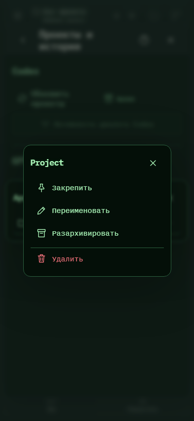

# 064. Project

**Телефон · 393 × 852 · тема `crt-green`.**

Контекстные действия над конкретным проектом или чатом.

**Как открыть:** Кнопка ⋯ рядом с проектом или диалогом.

**Снято после:** Действия: Project. Рабочее состояние.

Вложенное окно поверх сохранённого родительского экрана. Затемнение и видимые края родителя входят в снимок.

**Действия:** «Закрыть действия»; «Закрепить»; «Переименовать»; «Разархивировать»; «Удалить».

**Для обсуждения:** Разделены ли обычные действия и удаление? Всегда ли видно, над каким объектом выполняется действие?

Снимок фиксирует вид интерфейса. Данные демонстрационные; ошибки, ожидания и конфликты могли быть созданы сценарием. Это не подтверждение состояния рабочего сервера или реальных интеграций.

**Источник:** [EntityMenu.tsx](../../apps/web/src/EntityMenu.tsx). Сценарий `polish-extra.mjs`; код `56214b0`, 2026-10-02. Chromium; размер окна эмулируется, это не физический iPhone.

[Другой размер](064-desktop.md) · [Раздел](README.md) · [Весь каталог](../README.md)
