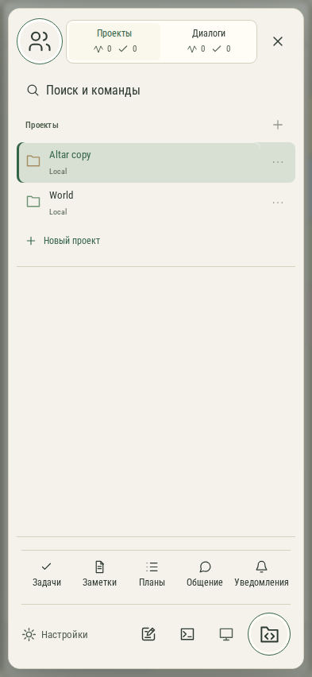

# 080. Проекты и диалоги

**Телефон · 393 × 852 · тема `organizer`.**

Выбор проекта или диалога, личного либо общего рабочего пространства.

**Как открыть:** Кнопка меню в левом верхнем углу.

**Снято после:** Открыть проекты. Рабочее состояние.

**Действия:** «Общие пространства»; «Проекты 200»; «Диалоги 000»; «Закрыть проекты»; «Поиск и командыCtrl / ⌘+K»; «Создать проект»; «Altar copyLocal»; «Действия: Altar copy»; «WorldLocal»; «Действия: World»; «Новый проект»; «Задачи»; «Заметки»; «Планы»; дополнительные действия в прокручиваемой области.

**Для обсуждения:** Понятны ли переключатели клиентов и личного/общего режима? Легко ли отличить активную работу от непрочитанного ответа?

Снимок фиксирует вид интерфейса. Данные демонстрационные; ошибки, ожидания и конфликты могли быть созданы сценарием. Это не подтверждение состояния рабочего сервера или реальных интеграций.

**Источник:** [App.tsx](../../apps/web/src/App.tsx), [GptWorkspace.tsx](../../apps/web/src/GptWorkspace.tsx). Сценарий `communication`; код `56214b0`, 2026-10-02. Chromium; размер окна эмулируется, это не физический iPhone.

[Другой размер](080-desktop.md) · [Раздел](README.md) · [Весь каталог](../README.md)
