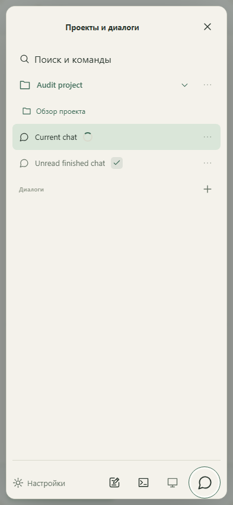

# 087. Проекты и диалоги

**Телефон · 393 × 852 · тема `по умолчанию`.**

Выбор проекта или диалога, личного либо общего рабочего пространства.

**Как открыть:** Кнопка меню в левом верхнем углу.

**Снято после:** Audit project. Рабочее состояние.

**Действия:** «Закрыть проекты»; «Поиск и командыCtrl / ⌘+K»; «Audit project»; «Действия: Audit project»; «Обзор проекта»; «Current chat»; «Действия: Current chat»; «Unread finished chat»; «Действия: Unread finished chat»; «Новый чат GPT»; «Настройки»; «Быстрая запись»; «Открыть устройства»; «Открыть Remote»; дополнительные действия в прокручиваемой области.

**Для обсуждения:** Понятны ли переключатели клиентов и личного/общего режима? Легко ли отличить активную работу от непрочитанного ответа?

Снимок фиксирует вид интерфейса. Данные демонстрационные; ошибки, ожидания и конфликты могли быть созданы сценарием. Это не подтверждение состояния рабочего сервера или реальных интеграций.

**Источник:** [App.tsx](../../apps/web/src/App.tsx), [GptWorkspace.tsx](../../apps/web/src/GptWorkspace.tsx). Сценарий `gpt-progress-queue`; код `56214b0`, 2026-10-02. Chromium; размер окна эмулируется, это не физический iPhone.

[Другой размер](087-desktop.md) · [Раздел](README.md) · [Весь каталог](../README.md)
