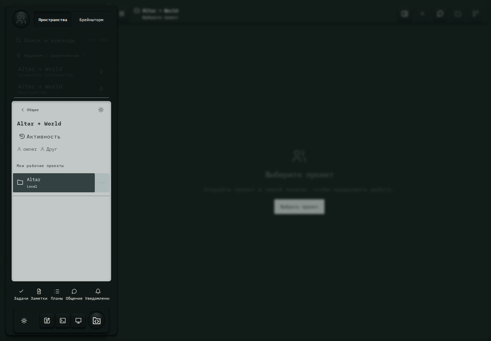

# 099. Проекты и диалоги

**Широкий экран · 1440 × 1000 · тема `crt-green`.**

Выбор проекта или диалога, личного либо общего рабочего пространства.

**Как открыть:** Кнопка меню в левом верхнем углу.

**Снято после:** Закрыть пространство. Рабочее состояние.

**Действия:** «Личные проекты»; «Пространства»; «Брейншторм»; «Закрыть проекты»; «Поиск и командыCtrl / ⌘+K»; «Недавнее / закреплённое»; «Altar + WorldАктивность пространства»; «Закрепить: Altar + World»; «Altar + WorldПространство»; «Общие»; «Настройки пространства»; «Активность»; «AltarLocal»; «Действия: Altar»; дополнительные действия в прокручиваемой области.

**Для обсуждения:** Понятны ли переключатели клиентов и личного/общего режима? Легко ли отличить активную работу от непрочитанного ответа?

Снимок фиксирует вид интерфейса. Данные демонстрационные; ошибки, ожидания и конфликты могли быть созданы сценарием. Это не подтверждение состояния рабочего сервера или реальных интеграций.

**Источник:** [App.tsx](../../apps/web/src/App.tsx), [GptWorkspace.tsx](../../apps/web/src/GptWorkspace.tsx). Сценарий `space-activity`; код `56214b0`, 2026-10-02. Chromium; размер окна эмулируется, это не физический iPhone.

[Другой размер](099-phone.md) · [Раздел](README.md) · [Весь каталог](../README.md)
