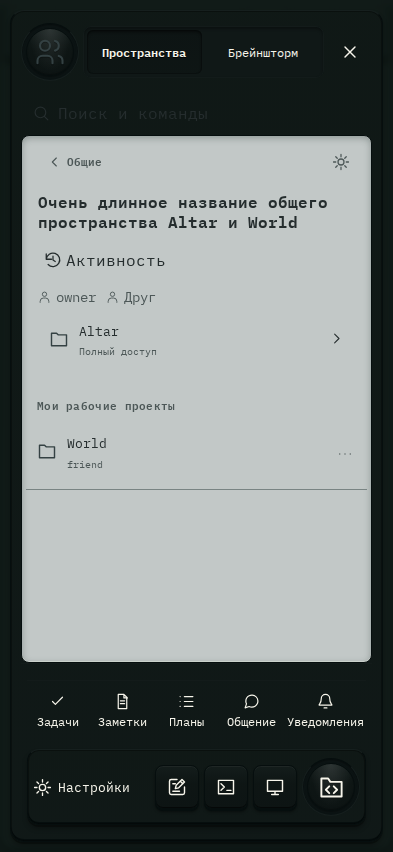

# 108. Проекты и диалоги

**Телефон · 393 × 852 · тема `crt-green`.**

Выбор проекта или диалога, личного либо общего рабочего пространства.

**Как открыть:** Кнопка меню в левом верхнем углу.

**Снято после:** Присоединиться. Рабочее состояние.

**Действия:** «Личные проекты»; «Пространства»; «Брейншторм»; «Поиск и командыCtrl / ⌘+K»; «Общие»; «Настройки пространства»; «Активность»; «AltarПолный доступ»; «Worldfriend»; «Действия: World»; «Задачи»; «Заметки»; «Планы»; «Общение»; дополнительные действия в прокручиваемой области.

**Для обсуждения:** Понятны ли переключатели клиентов и личного/общего режима? Легко ли отличить активную работу от непрочитанного ответа?

Снимок фиксирует вид интерфейса. Данные демонстрационные; ошибки, ожидания и конфликты могли быть созданы сценарием. Это не подтверждение состояния рабочего сервера или реальных интеграций.

**Источник:** [App.tsx](../../apps/web/src/App.tsx), [GptWorkspace.tsx](../../apps/web/src/GptWorkspace.tsx). Сценарий `space-github-access`; код `56214b0`, 2026-10-02. Chromium; размер окна эмулируется, это не физический iPhone.

[Другой размер](108-desktop.md) · [Раздел](README.md) · [Весь каталог](../README.md)
