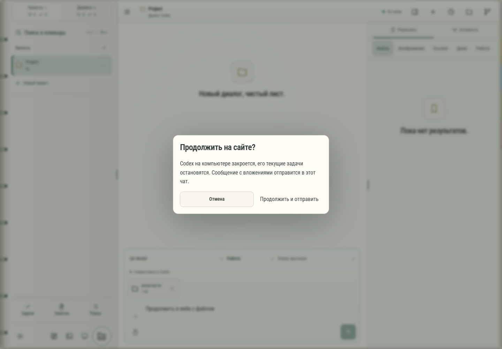

# 114. Продолжить на сайте?

**Широкий экран · 1440 × 1000 · тема `organizer`.**

Передача управления текущим диалогом между вебом и настольным клиентом.

**Как открыть:** Подключение Codex → Продолжить на сайте либо действие передачи.

**Снято после:** Отправить сообщение. Рабочее состояние.

**Действия:** «Отмена»; «Продолжить и отправить».

**Для обсуждения:** Понятно ли, что именно переключается? Как объяснить ожидание без ощущения, что чат сломан?

Снимок фиксирует вид интерфейса. Данные демонстрационные; ошибки, ожидания и конфликты могли быть созданы сценарием. Это не подтверждение состояния рабочего сервера или реальных интеграций.

**Источник:** [WebHandoff.tsx](../../apps/web/src/WebHandoff.tsx). Сценарий `turn-handoff`; код `56214b0`, 2026-10-02. Chromium; размер окна эмулируется, это не физический iPhone.

[Другой размер](114-phone.md) · [Раздел](README.md) · [Весь каталог](../README.md)
