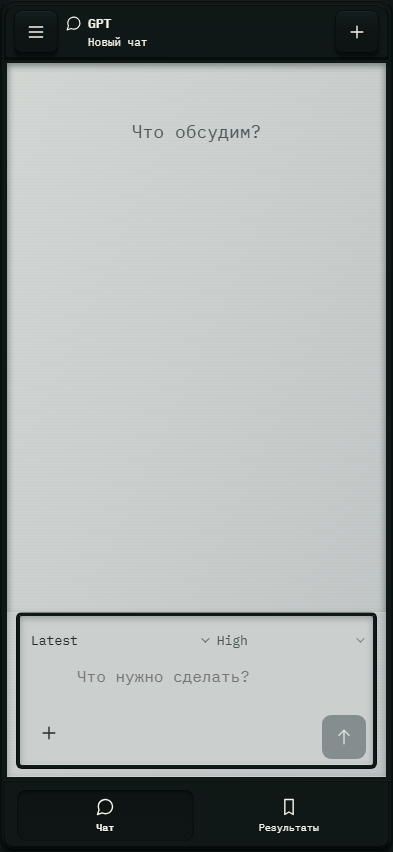

# 122. Пока нет результатов.

**Телефон · 393 × 852 · тема `crt-green`.**

Диалог GPT, его сообщения, очередь, результаты и состояние подключения.

**Как открыть:** Переключатель GPT → выбор диалога.

**Снято после:** Новый чат GPT. Рабочее состояние.

**Действия:** «Добавить файлы»; «Отправить GPT»; «Найти файл в результатах»; «Файлы»; «Изображения»; «Ссылки»; «Демо»; «Работа».

**Поля и параметры:** «Модель GPT»; «Мощность GPT»; «Сообщение GPT».

**Для обсуждения:** Понятны ли доставка сообщения и состояние ответа? Удобно ли продолжать работу и переходить к результатам?

Снимок фиксирует вид интерфейса. Данные демонстрационные; ошибки, ожидания и конфликты могли быть созданы сценарием. Это не подтверждение состояния рабочего сервера или реальных интеграций.

**Источник:** [GptWorkspace.tsx](../../apps/web/src/GptWorkspace.tsx). Сценарий `gpt-operations`; код `56214b0`, 2026-10-02. Chromium; размер окна эмулируется, это не физический iPhone.

[Другой размер](122-desktop.md) · [Раздел](README.md) · [Весь каталог](../README.md)
