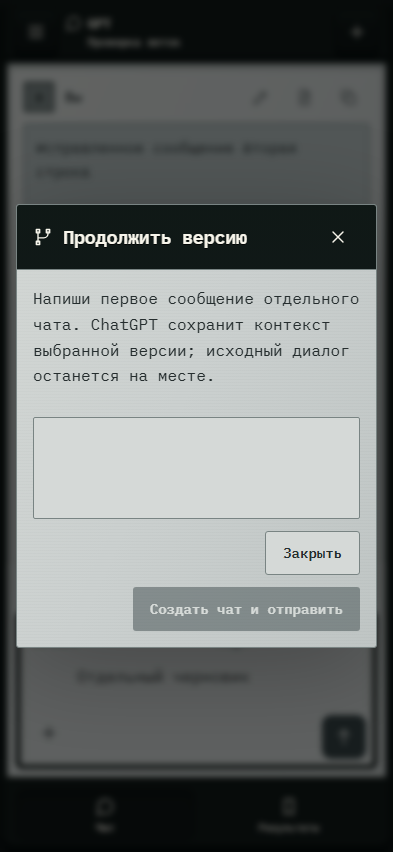

# 129. Продолжить версию GPT

**Телефон · 393 × 852 · тема `crt-green`.**

Редактирование сообщения, повтор ответа или продолжение выбранной версии GPT.

**Как открыть:** Действие под сообщением GPT.

**Снято после:** Продолжить в новом чате. Рабочее состояние.

**Действия:** «Закрыть»; «Создать чат и отправить».

**Поля и параметры:** «Первое сообщение новой ветки».

**Для обсуждения:** Очевидна ли исходная ветка и что будет отправлено? Различимы ли изменение текста и создание продолжения?

Снимок фиксирует вид интерфейса. Данные демонстрационные; ошибки, ожидания и конфликты могли быть созданы сценарием. Это не подтверждение состояния рабочего сервера или реальных интеграций.

**Источник:** [GptNativeOperations.tsx](../../apps/web/src/GptNativeOperations.tsx). Сценарий `gpt-operations`; код `56214b0`, 2026-10-02. Chromium; размер окна эмулируется, это не физический iPhone.

[Другой размер](129-desktop.md) · [Раздел](README.md) · [Весь каталог](../README.md)
