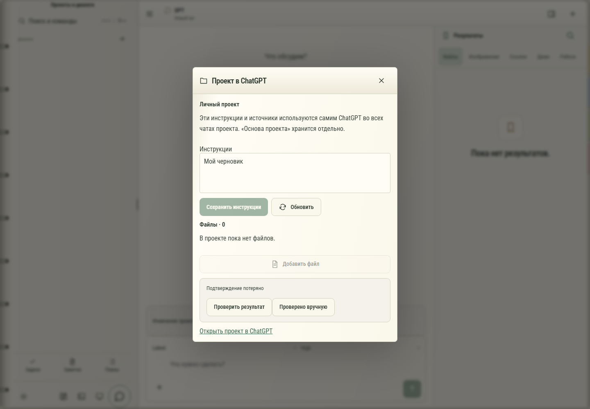

# 132. Инструкции и файлы ChatGPT

**Широкий экран · 1440 × 1000 · тема `organizer`.**

Инструкции и файлы, связанные с проектом ChatGPT.

**Как открыть:** Проект GPT → Инструкции и файлы ChatGPT.

**Снято после:** Сохранить инструкции. Рабочее состояние.

**Действия:** «Закрыть проект ChatGPT»; «Сохранить инструкции»; «Обновить»; «Добавить файл»; «Проверить результат»; «Проверено вручную».

**Поля и параметры:** «Инструкции проекта ChatGPT».

**Для обсуждения:** Удобно ли менять инструкции и одновременно видеть список материалов? Понятны ли права и состояние загрузки?

Снимок фиксирует вид интерфейса. Данные демонстрационные; ошибки, ожидания и конфликты могли быть созданы сценарием. Это не подтверждение состояния рабочего сервера или реальных интеграций.

**Источник:** [GptProjectContent.tsx](../../apps/web/src/GptProjectContent.tsx). Сценарий `gpt-project-content`; код `56214b0`, 2026-10-02. Chromium; размер окна эмулируется, это не физический iPhone.

[Другой размер](132-phone.md) · [Раздел](README.md) · [Весь каталог](../README.md)
