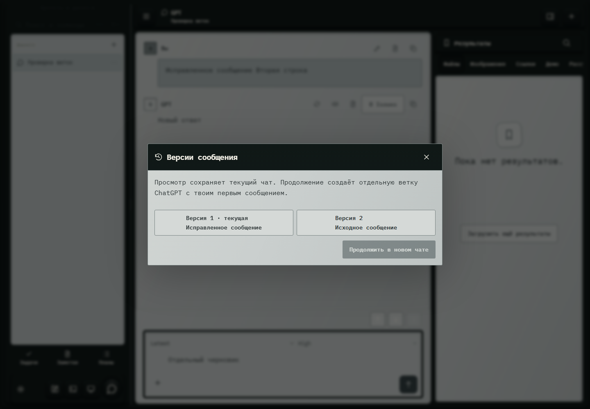

# 134. Версии сообщения

**Широкий экран · 1440 × 1000 · тема `crt-green`.**

Просмотр и выбор версий сообщения и связанных веток.

**Как открыть:** Переключатель версий сообщения GPT.

**Снято после:** Версии сообщения. Рабочее состояние.

**Действия:** «Закрыть версии»; «Версия 1 · текущаяИсправленное сообщение»; «Версия 2Исходное сообщение»; «Продолжить в новом чате».

**Для обсуждения:** Можно ли разобраться в ветках без технических терминов? Ясно ли, где текущая версия?

Снимок фиксирует вид интерфейса. Данные демонстрационные; ошибки, ожидания и конфликты могли быть созданы сценарием. Это не подтверждение состояния рабочего сервера или реальных интеграций.

**Источник:** [GptVersions.tsx](../../apps/web/src/GptVersions.tsx). Сценарий `gpt-operations`; код `56214b0`, 2026-10-02. Chromium; размер окна эмулируется, это не физический iPhone.

[Другой размер](134-phone.md) · [Раздел](README.md) · [Весь каталог](../README.md)
