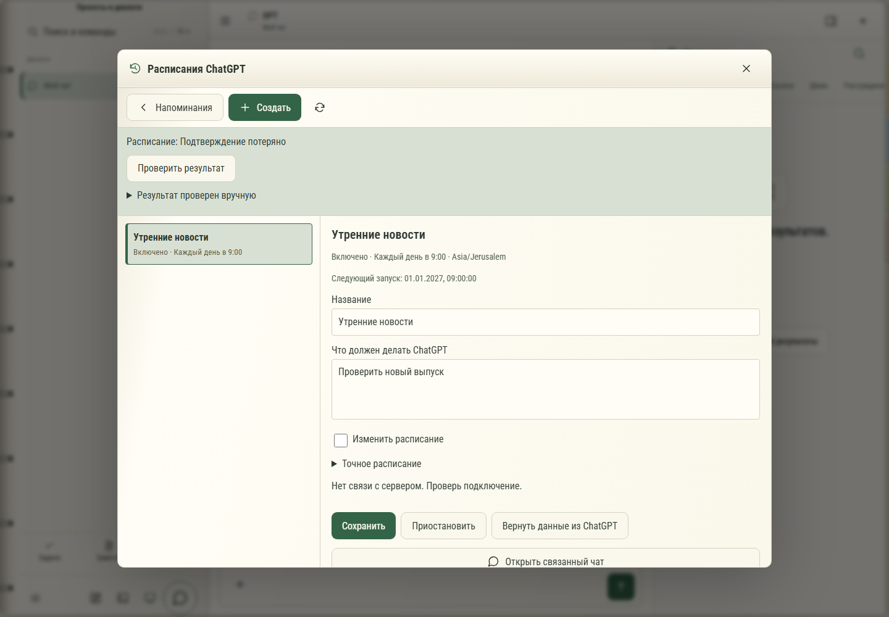

# 141. Расписания ChatGPT

**Широкий экран · 1440 × 1000 · тема `organizer`.**

Рабочая история или состояние нативного клиента в отдельном окне.

**Как открыть:** Настройки → Проекты и история → активность клиента.

**Снято после:** Сохранить. Сообщение об ошибке или проверке.

**Действия:** «Закрыть»; «Напоминания»; «Новое расписание»; «Обновить расписания»; «Проверить результат»; «Подтверждаю проверку»; «Все расписания»; «Сохранить»; «Приостановить»; «Вернуть данные из ChatGPT»; «Открыть связанный чат».

**Поля и параметры:** «Название»; «Что должен делать ChatGPTПроверить новый выпуск»; «Изменить расписание».

**Для обсуждения:** Не перегружает ли история событий обычный сценарий? Как отделить диагностику от пользовательского результата?

Снимок фиксирует вид интерфейса. Данные демонстрационные; ошибки, ожидания и конфликты могли быть созданы сценарием. Это не подтверждение состояния рабочего сервера или реальных интеграций.

**Источник:** [NativeWorkspace.tsx](../../apps/web/src/NativeWorkspace.tsx). Сценарий `gpt-workspace`; код `56214b0`, 2026-10-02. Chromium; размер окна эмулируется, это не физический iPhone.

[Другой размер](141-phone.md) · [Раздел](README.md) · [Весь каталог](../README.md)
