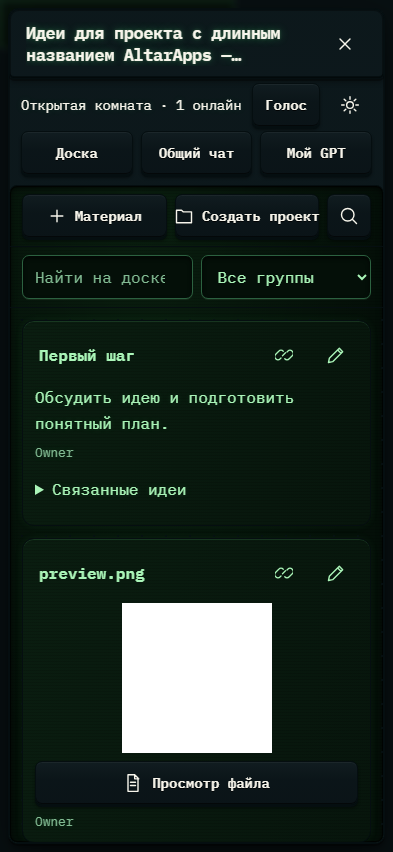

# 150. Идеи для проекта с длинным названием AltarApps — совместное пространство

**Телефон · 393 × 852 · тема `crt-green`.**

Личное обсуждение проекта с GPT поверх основной рабочей области.

**Как открыть:** Обзор проекта → Обсудить.

**Снято после:** Поиск и группы. Рабочее состояние.

Компонент открыт в изолированном стенде. Демонстрационный фон и кнопки запуска вне окна не являются отдельным экраном продукта.

**Действия:** «Закрыть»; «Голосовой разговор»; «Настройки комнаты»; «Доска»; «Общий чат»; «Мой GPT»; «Материал»; «Создать проект»; «Поиск и группы»; «Переместить Первый шаг»; «Соединить Первый шаг»; «Изменить Первый шаг»; «Переместить preview.png»; «Соединить preview.png»; дополнительные действия в прокручиваемой области.

**Поля и параметры:** «Поиск по доске»; «Группа карточек».

**Для обсуждения:** Достаточно ли различаются вложенный чат и основной? Удобны ли переходы к подготовке материалов для Codex?

Снимок фиксирует вид интерфейса. Данные демонстрационные; ошибки, ожидания и конфликты могли быть созданы сценарием. Это не подтверждение состояния рабочего сервера или реальных интеграций.

**Источник:** [ProjectGptWindow.tsx](../../apps/web/src/ProjectGptWindow.tsx). Сценарий `brainstorm`; код `56214b0`, 2026-10-02. Chromium; размер окна эмулируется, это не физический iPhone.

[Другой размер](150-desktop.md) · [Раздел](README.md) · [Весь каталог](../README.md)
