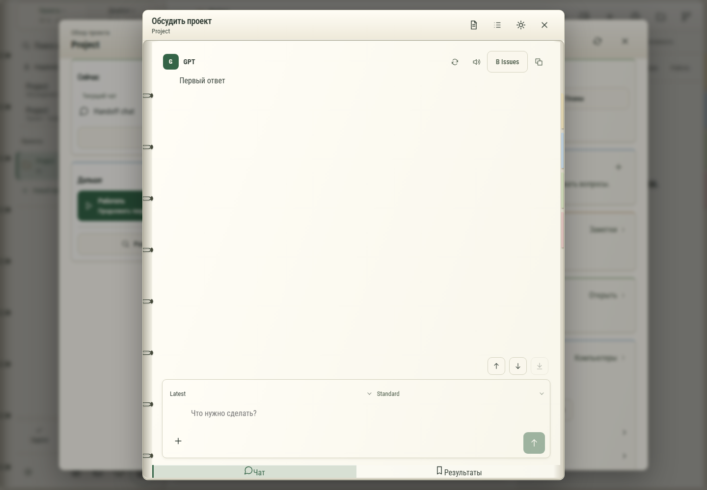

# 168. GPT проекта Project

**Широкий экран · 1440 × 1000 · тема `organizer`.**

Личное обсуждение проекта с GPT поверх основной рабочей области.

**Как открыть:** Обзор проекта → Обсудить.

**Снято после:** Выбрать чат. Рабочее состояние.

Вложенное окно поверх сохранённого родительского экрана. Затемнение и видимые края родителя входят в снимок.

**Действия:** «Подготовить для Codex»; «Подготовить Issues»; «Настройки GPT проекта»; «Закрыть GPT проекта»; «Повторить ответ GPT»; «Озвучить ответ»; «В Issues»; «Копировать сообщение»; «Предыдущее сообщение»; «Следующее сообщение»; «В конец чата»; «Добавить файлы»; «Отправить GPT»; «Чат»; дополнительные действия в прокручиваемой области.

**Поля и параметры:** «Модель GPT»; «Мощность GPT»; «Сообщение GPT».

**Для обсуждения:** Достаточно ли различаются вложенный чат и основной? Удобны ли переходы к подготовке материалов для Codex?

Снимок фиксирует вид интерфейса. Данные демонстрационные; ошибки, ожидания и конфликты могли быть созданы сценарием. Это не подтверждение состояния рабочего сервера или реальных интеграций.

**Источник:** [ProjectGptWindow.tsx](../../apps/web/src/ProjectGptWindow.tsx). Сценарий `project-gpt`; код `56214b0`, 2026-10-02. Chromium; размер окна эмулируется, это не физический iPhone.

[Другой размер](168-phone.md) · [Раздел](README.md) · [Весь каталог](../README.md)
