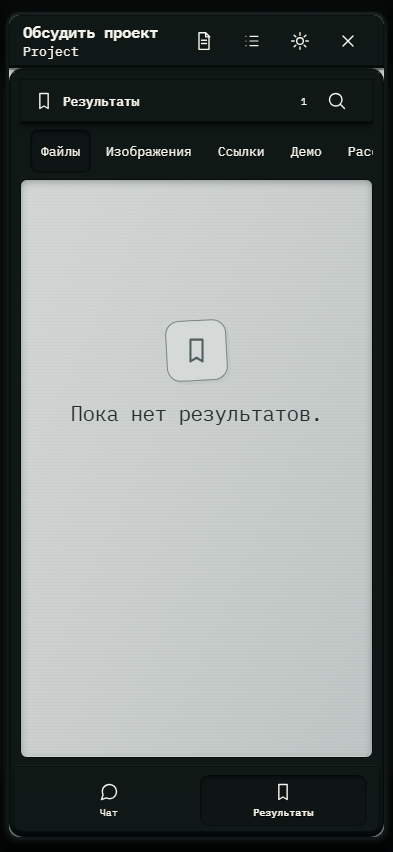

# 171. GPT проекта Project

**Телефон · 393 × 852 · тема `crt-green`.**

Личное обсуждение проекта с GPT поверх основной рабочей области.

**Как открыть:** Обзор проекта → Обсудить.

**Снято после:** Результаты. Рабочее состояние.

Вложенное окно поверх сохранённого родительского экрана. Затемнение и видимые края родителя входят в снимок.

**Действия:** «Подготовить для Codex»; «Подготовить Issues»; «Настройки GPT проекта»; «Закрыть GPT проекта»; «Найти файл в результатах»; «Файлы»; «Изображения»; «Ссылки»; «Демо»; «Рассуждения1»; «Чат»; «Результаты».

**Для обсуждения:** Достаточно ли различаются вложенный чат и основной? Удобны ли переходы к подготовке материалов для Codex?

Снимок фиксирует вид интерфейса. Данные демонстрационные; ошибки, ожидания и конфликты могли быть созданы сценарием. Это не подтверждение состояния рабочего сервера или реальных интеграций.

**Источник:** [ProjectGptWindow.tsx](../../apps/web/src/ProjectGptWindow.tsx). Сценарий `project-gpt`; код `56214b0`, 2026-10-02. Chromium; размер окна эмулируется, это не физический iPhone.

[Другой размер](171-desktop.md) · [Раздел](README.md) · [Весь каталог](../README.md)
