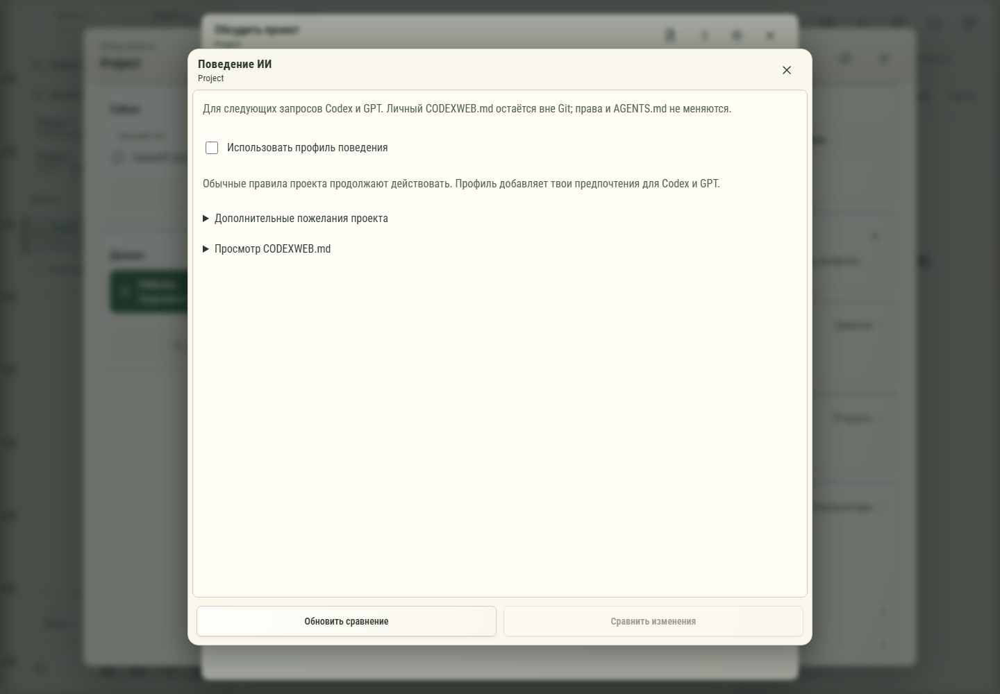

# 183. Поведение ИИ проекта

**Широкий экран · 1440 × 1000 · тема `organizer`.**

Настройка профиля поведения ИИ и просмотр предлагаемых изменений.

**Как открыть:** Обзор проекта → Поведение ИИ.

**Снято после:** Поведение ИИ. Рабочее состояние.

Вложенное окно поверх сохранённого родительского экрана. Затемнение и видимые края родителя входят в снимок.

**Действия:** «Закрыть профиль»; «Обновить сравнение»; «Сравнить изменения».

**Поля и параметры:** «Использовать профиль поведения»; «Проверять влияние изменений на связанные проекты»; «Запускать подходящие тесты и сборку»; «Не делать несвязанный рефакторинг»; «Согласовывать новые зависимости»; «Предлагать технические issues для отдельной работы»; «Свои правила проекта».

**Для обсуждения:** Понятно ли, какие правила наследуются и что будет изменено? Удобно ли сравнение перед применением?

Снимок фиксирует вид интерфейса. Данные демонстрационные; ошибки, ожидания и конфликты могли быть созданы сценарием. Это не подтверждение состояния рабочего сервера или реальных интеграций.

**Источник:** [AgentProfileEditor.tsx](../../apps/web/src/AgentProfileEditor.tsx). Сценарий `project-gpt`; код `56214b0`, 2026-10-02. Chromium; размер окна эмулируется, это не физический iPhone.

[Другой размер](183-phone.md) · [Раздел](README.md) · [Весь каталог](../README.md)
