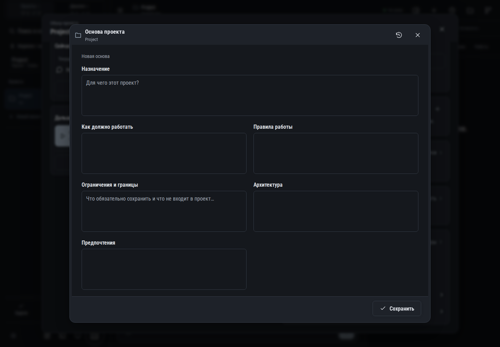

# 186. Основа проекта

**Широкий экран · 1440 × 1000 · тема `classic-dark`.**

Редактирование назначения, архитектуры и основы проекта; история версий.

**Как открыть:** Обзор проекта → Основа проекта → Открыть.

**Снято после:** Открыть. Рабочее состояние.

Вложенное окно поверх сохранённого родительского экрана. Затемнение и видимые края родителя входят в снимок.

**Действия:** «История основы проекта»; «Закрыть основу проекта»; «Сохранить».

**Поля и параметры:** «Назначение»; «Как должно работать»; «Правила работы»; «Ограничения и границы»; «Архитектура»; «Предпочтения».

**Для обсуждения:** Удобно ли работать с длинными описаниями? Как яснее показать конфликт версий и восстановление?

Снимок фиксирует вид интерфейса. Данные демонстрационные; ошибки, ожидания и конфликты могли быть созданы сценарием. Это не подтверждение состояния рабочего сервера или реальных интеграций.

**Источник:** [ProjectCore.tsx](../../apps/web/src/ProjectCore.tsx). Сценарий `project-core`; код `56214b0`, 2026-10-02. Chromium; размер окна эмулируется, это не физический iPhone.

[Другой размер](186-phone.md) · [Раздел](README.md) · [Весь каталог](../README.md)
