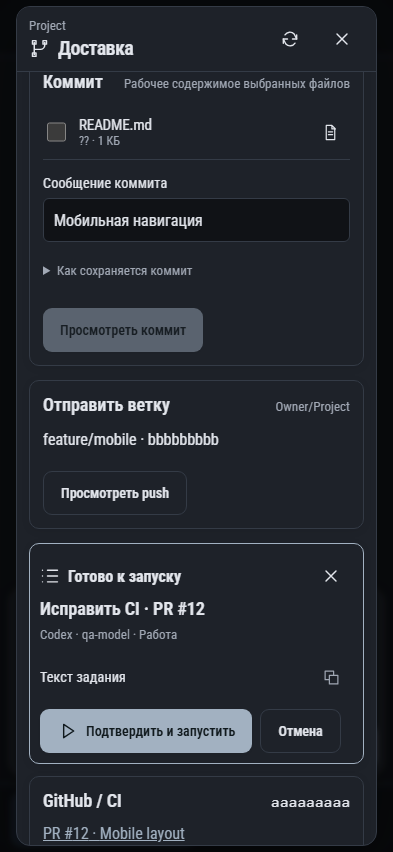

# 197. Доставка проекта

**Телефон · 393 × 852 · тема `classic-dark`.**

Проверка изменений и последовательные действия Git: коммит, push, PR.

**Как открыть:** Обзор проекта → Доставка; либо из Git проекта.

**Снято после:** Попросить Codex исправить CI. Сообщение об ошибке или проверке.

**Действия:** «Обновить доставку»; «Закрыть доставку»; «Копировать HEAD»; «Посмотреть изменения README.md»; «Просмотреть коммит»; «Просмотреть push»; «Закрыть задание»; «Копировать задание»; «Подтвердить и запустить»; «Отмена»; «Попросить Codex исправить CI»; «Коммит · bbbbbbbbbГотово · 02.10.2026, 12:30:33».

**Поля и параметры:** «README.md?? · 1 КБ»; «Сообщение коммита».

**Для обсуждения:** Достаточно ли понятно, что уже выполнено и что будет следующим действием? Удобен ли просмотр изменений перед отправкой?

Снимок фиксирует вид интерфейса. Данные демонстрационные; ошибки, ожидания и конфликты могли быть созданы сценарием. Это не подтверждение состояния рабочего сервера или реальных интеграций.

**Источник:** [ProjectDelivery.tsx](../../apps/web/src/ProjectDelivery.tsx). Сценарий `project-delivery`; код `56214b0`, 2026-10-02. Chromium; размер окна эмулируется, это не физический iPhone.

[Другой размер](197-desktop.md) · [Раздел](README.md) · [Весь каталог](../README.md)
