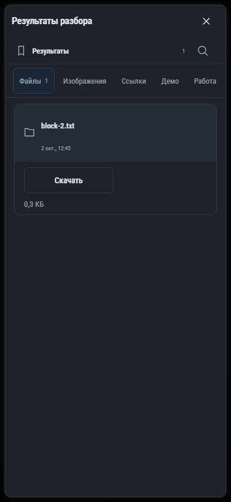

# 198. Результаты разбора

**Телефон · 393 × 852 · тема `classic-dark`.**

Просмотр итогов разбора задачи и подготовленных материалов.

**Как открыть:** Разбор задачи → Результаты разбора.

**Снято после:** Закрыть просмотр. Рабочее состояние.

Вложенное окно поверх сохранённого родительского экрана. Затемнение и видимые края родителя входят в снимок.

**Действия:** «Закрыть результаты разбора»; «Найти файл в результатах»; «Файлы1»; «Изображения»; «Ссылки»; «Демо»; «Работа»; «Открыть block-2.txt».

**Для обсуждения:** Удобно ли выбрать полезное из результатов и перейти к следующему действию?

Снимок фиксирует вид интерфейса. Данные демонстрационные; ошибки, ожидания и конфликты могли быть созданы сценарием. Это не подтверждение состояния рабочего сервера или реальных интеграций.

**Источник:** [IntakeWindow.tsx](../../apps/web/src/IntakeWindow.tsx). Сценарий `intake`; код `56214b0`, 2026-10-02. Chromium; размер окна эмулируется, это не физический iPhone.

[Другой размер](198-desktop.md) · [Раздел](README.md) · [Весь каталог](../README.md)
