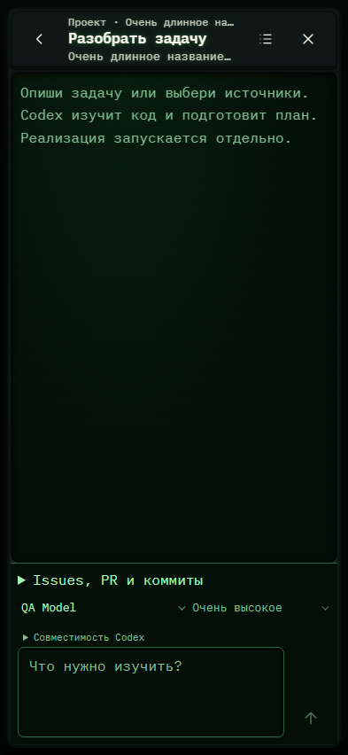

# 206. Разбор · Очень длинное название проекта · Общий репозиторий команды

**Телефон · 393 × 852 · тема `crt-green`.**

Уточнение и разбор задачи до начала реализации.

**Как открыть:** Обзор проекта → Разобрать задачу.

**Снято после:** Разобрать задачу. Рабочее состояние.

Вложенное окно поверх сохранённого родительского экрана. Затемнение и видимые края родителя входят в снимок.

**Действия:** «Назад: Проект · Очень длинное название проекта · Общий репозиторий команды»; «Подготовить Issues»; «Закрыть разбор»; «Отправить на разбор».

**Поля и параметры:** «Источники разбора»; «Модель Codex»; «Уровень размышления»; «Сообщение для разбора».

**Для обсуждения:** Понятно ли, что отправляется на разбор и куда попадёт ответ? Не перегружена ли форма?

Снимок фиксирует вид интерфейса. Данные демонстрационные; ошибки, ожидания и конфликты могли быть созданы сценарием. Это не подтверждение состояния рабочего сервера или реальных интеграций.

**Источник:** [IntakeWindow.tsx](../../apps/web/src/IntakeWindow.tsx). Сценарий `project-entry`; код `56214b0`, 2026-10-02. Chromium; размер окна эмулируется, это не физический iPhone.

[Другой размер](206-desktop.md) · [Раздел](README.md) · [Весь каталог](../README.md)
