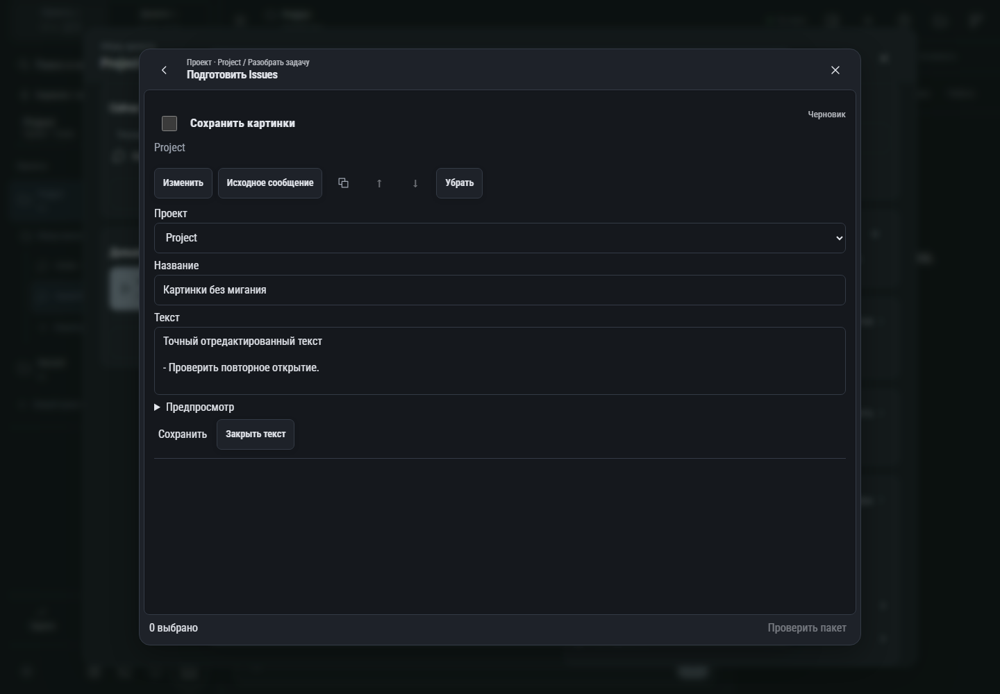

# 209. Подборка Issues

**Широкий экран · 1440 × 1000 · тема `classic-dark`.**

Подборка будущих Issues, редактирование, проверка и публикация с исходными сообщениями.

**Как открыть:** Обзор → Подготовить Issues / Создать Issue; либо В Issues под ответом GPT.

**Снято после:** Изменить. Рабочее состояние.

Вложенное окно поверх сохранённого родительского экрана. Затемнение и видимые края родителя входят в снимок.

**Действия:** «Назад: Разобрать задачу»; «Закрыть подборку»; «Изменить»; «Исходное сообщение»; «Копировать сообщение»; «Поднять: Сохранить картинки»; «Опустить: Сохранить картинки»; «Убрать»; «Сохранить»; «Закрыть текст»; «Проверить пакет».

**Поля и параметры:** «Выбрать: Сохранить картинки»; «Проект для Issue»; «Название Issue»; «Текст Issue».

**Для обсуждения:** Легко ли отличить подборку от уже опубликованных Issues? Хорошо ли видны порядок, источник и результат отправки?

Снимок фиксирует вид интерфейса. Данные демонстрационные; ошибки, ожидания и конфликты могли быть созданы сценарием. Это не подтверждение состояния рабочего сервера или реальных интеграций.

**Источник:** [IssueDrawer.tsx](../../apps/web/src/IssueDrawer.tsx). Сценарий `issue-drawer`; код `56214b0`, 2026-10-02. Chromium; размер окна эмулируется, это не физический iPhone.

[Другой размер](209-phone.md) · [Раздел](README.md) · [Весь каталог](../README.md)
