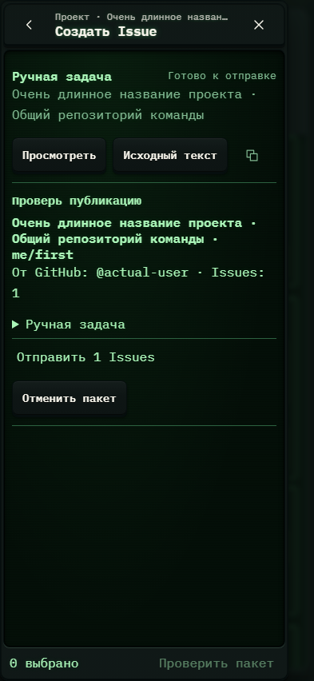

# 212. Подборка Issues

**Телефон · 393 × 852 · тема `crt-green`.**

Подборка будущих Issues, редактирование, проверка и публикация с исходными сообщениями.

**Как открыть:** Обзор → Подготовить Issues / Создать Issue; либо В Issues под ответом GPT.

**Снято после:** Проверить публикацию. Рабочее состояние.

Вложенное окно поверх сохранённого родительского экрана. Затемнение и видимые края родителя входят в снимок.

**Действия:** «Назад: Проект · Очень длинное название проекта · Общий репозиторий команды»; «Закрыть подборку»; «Просмотреть»; «Исходный текст»; «Копировать сообщение»; «Отправить 1 Issues»; «Отменить пакет»; «Проверить пакет».

**Для обсуждения:** Легко ли отличить подборку от уже опубликованных Issues? Хорошо ли видны порядок, источник и результат отправки?

Снимок фиксирует вид интерфейса. Данные демонстрационные; ошибки, ожидания и конфликты могли быть созданы сценарием. Это не подтверждение состояния рабочего сервера или реальных интеграций.

**Источник:** [IssueDrawer.tsx](../../apps/web/src/IssueDrawer.tsx). Сценарий `project-entry`; код `56214b0`, 2026-10-02. Chromium; размер окна эмулируется, это не физический iPhone.

[Другой размер](212-desktop.md) · [Раздел](README.md) · [Весь каталог](../README.md)
