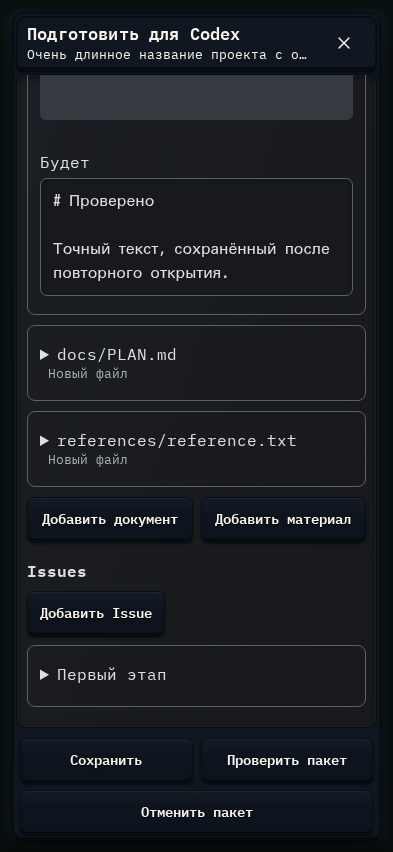

# 218. Подготовить для Codex · Project

**Телефон · 393 × 852 · тема `crt-green`.**

Подготовка файлов, контекста и Issues из обсуждения для работы Codex.

**Как открыть:** GPT проекта → Подготовить для Codex.

**Снято после:** Открытое состояние. Рабочее состояние.

Вложенное окно поверх сохранённого родительского экрана. Затемнение и видимые края родителя входят в снимок.

**Действия:** «Закрыть подготовку»; «Добавить документ»; «Добавить Issue»; «Не публиковать этот Issue»; «Сохранить»; «Проверить пакет»; «Отменить пакет».

**Поля и параметры:** «Название пакета»; «Путь файла 1»; «Действие с файлом 1»; «Содержимое файла 1»; «Путь файла 2»; «Действие с файлом 2»; «Содержимое файла 2»; «Путь файла 3»; «Действие с файлом 3»; «Содержимое файла 3».

**Для обсуждения:** Не слишком ли много решений на одном экране? Видно ли отличие черновика от опубликованных материалов?

Снимок фиксирует вид интерфейса. Данные демонстрационные; ошибки, ожидания и конфликты могли быть созданы сценарием. Это не подтверждение состояния рабочего сервера или реальных интеграций.

**Источник:** [ProjectPreparation.tsx](../../apps/web/src/ProjectPreparation.tsx). Сценарий `project-preparation`; код `56214b0`, 2026-10-02. Chromium; размер окна эмулируется, это не физический iPhone.

[Другой размер](218-desktop.md) · [Раздел](README.md) · [Весь каталог](../README.md)
