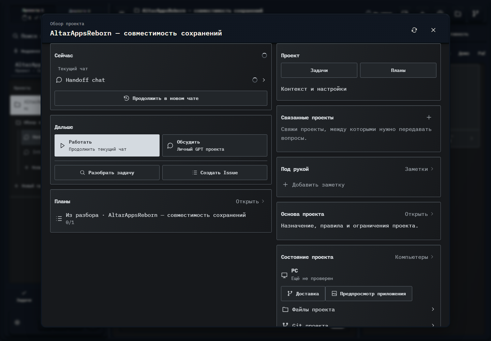

# 226. Обзор проекта AltarAppsReborn — совместимость сохранений

**Широкий экран · 1440 × 1000 · тема `crt-green`.**

Обзор текущей работы, задач, материалов и инструментов проекта.

**Как открыть:** Нажатие на название текущего проекта в шапке.

**Снято после:** Закрыть разбор. Рабочее состояние.

**Действия:** «Обновить обзор проекта»; «Закрыть обзор проекта»; «Handoff chat»; «Продолжить в новом чате»; «РаботатьПродолжить текущий чат»; «ОбсудитьЛичный GPT проекта»; «Разобрать задачу»; «Создать Issue»; «Открыть»; «Из разбора · AltarAppsReborn — совместимость сохранений0/1»; «Задачи»; «Планы»; «Поведение ИИ»; «Подготовить Issues»; дополнительные действия в прокручиваемой области.

**Для обсуждения:** Что должно быть первым экраном проекта? Не теряются ли основные действия среди служебных разделов?

Снимок фиксирует вид интерфейса. Данные демонстрационные; ошибки, ожидания и конфликты могли быть созданы сценарием. Это не подтверждение состояния рабочего сервера или реальных интеграций.

**Источник:** [ProjectOverview.tsx](../../apps/web/src/ProjectOverview.tsx). Сценарий `intake`; код `56214b0`, 2026-10-02. Chromium; размер окна эмулируется, это не физический iPhone.

[Другой размер](226-phone.md) · [Раздел](README.md) · [Весь каталог](../README.md)
