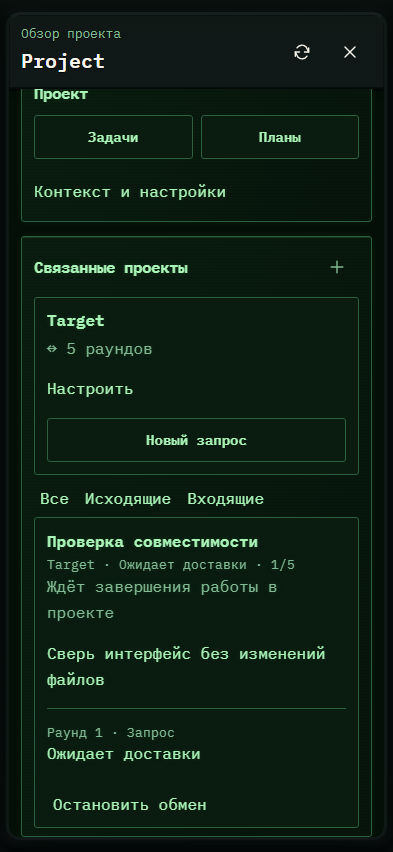

# 235. Обзор проекта Project

**Телефон · 393 × 852 · тема `crt-green`.**

Обзор текущей работы, задач, материалов и инструментов проекта.

**Как открыть:** Нажатие на название текущего проекта в шапке.

**Снято после:** Открытое состояние. Рабочее состояние.

**Действия:** «Обновить обзор проекта»; «Закрыть обзор проекта»; «Диалог Codex»; «Продолжить в новом чате»; «РаботатьПродолжить текущий чат»; «ОбсудитьЛичный GPT проекта»; «Разобрать задачу»; «Создать Issue»; «Задачи»; «Планы»; «Поведение ИИ»; «Подготовить Issues»; «Связать проект»; «Сохранить»; дополнительные действия в прокручиваемой области.

**Поля и параметры:** «Глубина обмена: Target»; «Автоматически передавать консультации»; «В обе стороны»; «Связь включена».

**Для обсуждения:** Что должно быть первым экраном проекта? Не теряются ли основные действия среди служебных разделов?

Снимок фиксирует вид интерфейса. Данные демонстрационные; ошибки, ожидания и конфликты могли быть созданы сценарием. Это не подтверждение состояния рабочего сервера или реальных интеграций.

**Источник:** [ProjectOverview.tsx](../../apps/web/src/ProjectOverview.tsx). Сценарий `project-relays`; код `56214b0`, 2026-10-02. Chromium; размер окна эмулируется, это не физический iPhone.

[Другой размер](235-desktop.md) · [Раздел](README.md) · [Весь каталог](../README.md)
