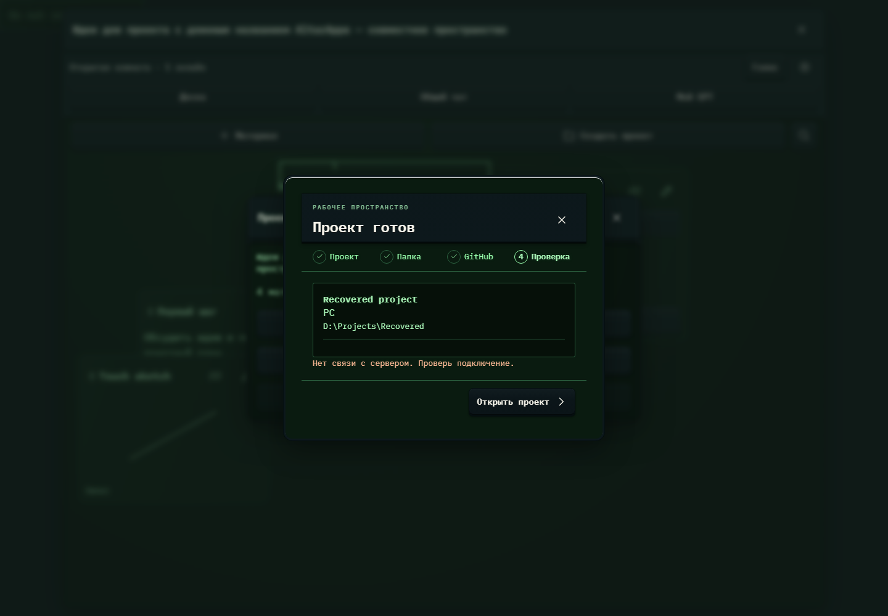

# 239. Создание проекта

**Широкий экран · 1440 × 1000 · тема `crt-green`.**

Создание проекта, подключение существующей папки или репозитория GitHub.

**Как открыть:** Меню → Новый проект / Создать проект.

**Снято после:** Открыть проект. Сообщение об ошибке или проверке.

Вложенное окно поверх сохранённого родительского экрана. Затемнение и видимые края родителя входят в снимок.

Компонент открыт в изолированном стенде. Демонстрационный фон и кнопки запуска вне окна не являются отдельным экраном продукта.

**Действия:** «Закрыть создание проекта»; «Открыть проект».

**Для обсуждения:** Понятен ли выбор стартового пути? Достаточно ли ясны шаги папки, GitHub и итоговой проверки?

Снимок фиксирует вид интерфейса. Данные демонстрационные; ошибки, ожидания и конфликты могли быть созданы сценарием. Это не подтверждение состояния рабочего сервера или реальных интеграций.

**Источник:** [ProjectDialog.tsx](../../apps/web/src/ProjectDialog.tsx). Сценарий `brainstorm`; код `56214b0`, 2026-10-02. Chromium; размер окна эмулируется, это не физический iPhone.

[Другой размер](239-phone.md) · [Раздел](README.md) · [Весь каталог](../README.md)
