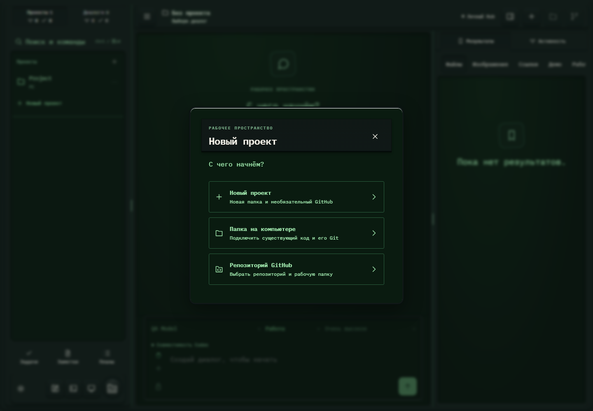

# 244. Создание проекта

**Широкий экран · 1440 × 1000 · тема `crt-green`.**

Создание проекта, подключение существующей папки или репозитория GitHub.

**Как открыть:** Меню → Новый проект / Создать проект.

**Снято после:** Открытое состояние. Рабочее состояние.

**Действия:** «Закрыть создание проекта»; «Новый проектНовая папка и необязательный GitHub»; «Папка на компьютереПодключить существующий код и его Git»; «Репозиторий GitHubВыбрать репозиторий и рабочую папку».

**Для обсуждения:** Понятен ли выбор стартового пути? Достаточно ли ясны шаги папки, GitHub и итоговой проверки?

Снимок фиксирует вид интерфейса. Данные демонстрационные; ошибки, ожидания и конфликты могли быть созданы сценарием. Это не подтверждение состояния рабочего сервера или реальных интеграций.

**Источник:** [ProjectDialog.tsx](../../apps/web/src/ProjectDialog.tsx). Сценарий `polish-extra.mjs`; код `56214b0`, 2026-10-02. Chromium; размер окна эмулируется, это не физический iPhone.

[Другой размер](244-phone.md) · [Раздел](README.md) · [Весь каталог](../README.md)
