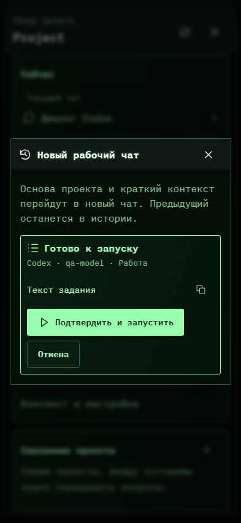

# 247. Новый рабочий чат

**Телефон · 393 × 852 · тема `crt-green`.**

Продолжение проектной работы в новом чате с сохранением нужного контекста.

**Как открыть:** Обзор проекта → Продолжить в новом чате.

**Снято после:** Продолжить в новом чате. Действие с подтверждением.

Вложенное окно поверх сохранённого родительского экрана. Затемнение и видимые края родителя входят в снимок.

**Действия:** «Закрыть переход»; «Копировать задание»; «Подтвердить и запустить»; «Отмена».

**Для обсуждения:** Ясны ли переносимый контекст и судьба старого чата? Насколько понятен подготовительный шаг?

Снимок фиксирует вид интерфейса. Данные демонстрационные; ошибки, ожидания и конфликты могли быть созданы сценарием. Это не подтверждение состояния рабочего сервера или реальных интеграций.

**Источник:** [ProjectRotation.tsx](../../apps/web/src/ProjectRotation.tsx). Сценарий `project-rotation`; код `56214b0`, 2026-10-02. Chromium; размер окна эмулируется, это не физический iPhone.

[Другой размер](247-desktop.md) · [Раздел](README.md) · [Весь каталог](../README.md)
