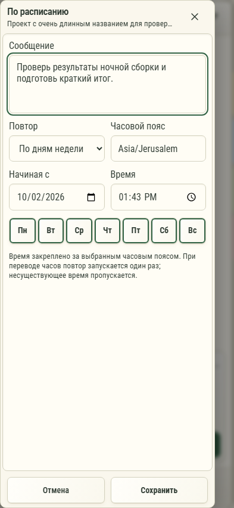

# 250. Сообщения по расписанию

**Телефон · 393 × 852 · тема `organizer`.**

Создание и редактирование сообщений, отправляемых Codex по расписанию.

**Как открыть:** Кнопка часов в шапке чата.

**Снято после:** Сообщения по расписанию. Рабочее состояние.

**Действия:** «Закрыть расписание»; «Пн»; «Вт»; «Ср»; «Чт»; «Пт»; «Сб»; «Вс»; «Отмена»; «Сохранить».

**Поля и параметры:** «Что отправить Codex позже?»; «Повтор»; «Часовой пояс»; «Начиная с»; «Время».

**Для обсуждения:** Ясны ли время, повтор и целевой чат? Как показать очередное выполнение без лишней тревоги?

Снимок фиксирует вид интерфейса. Данные демонстрационные; ошибки, ожидания и конфликты могли быть созданы сценарием. Это не подтверждение состояния рабочего сервера или реальных интеграций.

**Источник:** [CodexSchedules.tsx](../../apps/web/src/CodexSchedules.tsx). Сценарий `codex-schedules`; код `56214b0`, 2026-10-02. Chromium; размер окна эмулируется, это не физический iPhone.

[Другой размер](250-desktop.md) · [Раздел](README.md) · [Весь каталог](../README.md)
