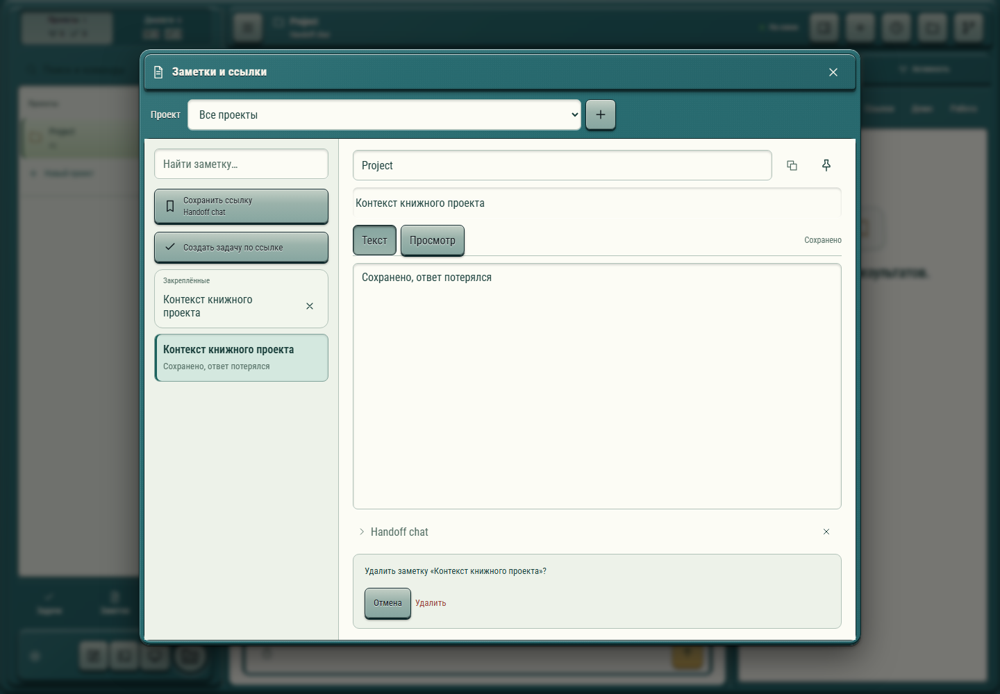

# 266. Заметки и ссылки

**Широкий экран · 1440 × 1000 · тема `hitech-2000s`.**

Заметки, ссылки и задачи: список, редактор, привязка к проекту и сохранение.

**Как открыть:** Нижние ярлыки меню → Задачи / Заметки.

**Снято после:** Удалить заметку. Рабочее состояние.

**Действия:** «Закрыть заметки»; «Новая заметка»; «Сохранить ссылкуHandoff chat»; «Создать задачу по ссылке»; «Контекст книжного проекта»; «Убрать ссылку: Контекст книжного проекта»; «Контекст книжного проектаСохранено, ответ потерялся»; «Копировать заметку»; «Закрепить заметку»; «Текст»; «Просмотр»; «Handoff chat»; «Убрать из заметки: Handoff chat»; «Отмена»; дополнительные действия в прокручиваемой области.

**Поля и параметры:** «Проекты заметок»; «Найти заметку»; «Проект заметки»; «Название заметки»; «Текст заметки».

**Для обсуждения:** Хорошо ли работают переходы список → запись → назад? Не теряются ли фильтр, черновик и связь с проектом?

Снимок фиксирует вид интерфейса. Данные демонстрационные; ошибки, ожидания и конфликты могли быть созданы сценарием. Это не подтверждение состояния рабочего сервера или реальных интеграций.

**Источник:** [Notebook.tsx](../../apps/web/src/Notebook.tsx). Сценарий `notebook`; код `56214b0`, 2026-10-02. Chromium; размер окна эмулируется, это не физический iPhone.

[Другой размер](266-phone.md) · [Раздел](README.md) · [Весь каталог](../README.md)
