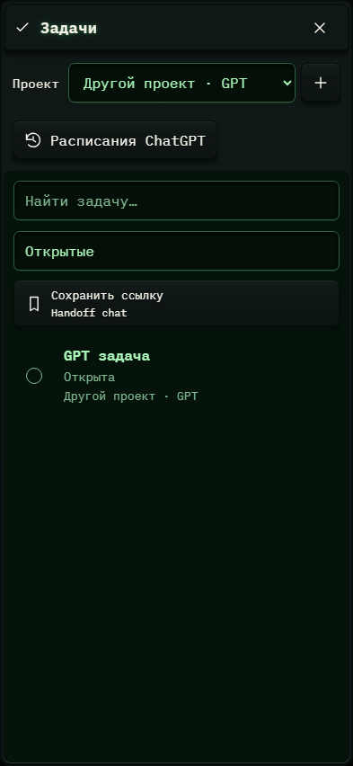

# 278. Задачи

**Телефон · 393 × 852 · тема `crt-green`.**

Заметки, ссылки и задачи: список, редактор, привязка к проекту и сохранение.

**Как открыть:** Нижние ярлыки меню → Задачи / Заметки.

**Снято после:** Проекты задач. Рабочее состояние.

**Действия:** «Закрыть задачи»; «Новая задача»; «Расписания ChatGPT»; «Сохранить ссылкуHandoff chat»; «Завершить: Личное напоминание»; «Личное напоминаниеОткрытаБез проекта».

**Поля и параметры:** «Проекты задач»; «Найти задачу»; «Состояние задач».

**Для обсуждения:** Хорошо ли работают переходы список → запись → назад? Не теряются ли фильтр, черновик и связь с проектом?

Снимок фиксирует вид интерфейса. Данные демонстрационные; ошибки, ожидания и конфликты могли быть созданы сценарием. Это не подтверждение состояния рабочего сервера или реальных интеграций.

**Источник:** [Notebook.tsx](../../apps/web/src/Notebook.tsx). Сценарий `tasks`; код `56214b0`, 2026-10-02. Chromium; размер окна эмулируется, это не физический iPhone.

[Другой размер](278-desktop.md) · [Раздел](README.md) · [Весь каталог](../README.md)
