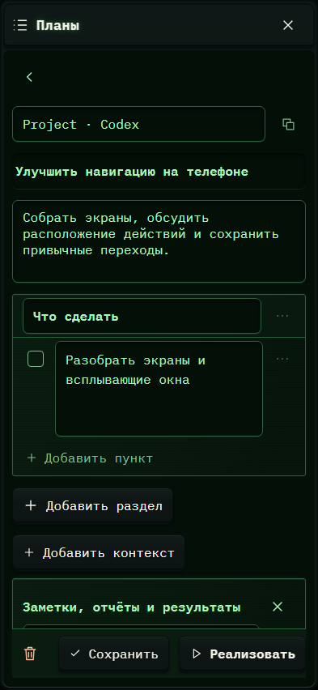

# 288. Планы

**Телефон · 393 × 852 · тема `crt-green`.**

Список и редактор планов с пунктами, разделами, контекстом и запуском реализации.

**Как открыть:** Меню → Планы; либо Планы в обзоре проекта.

**Снято после:** Открытое состояние. Рабочее состояние.

**Действия:** «Закрыть рабочий раздел»; «К списку»; «Копировать план»; «Поднять»; «Опустить»; «Удалить»; «Добавить пункт»; «Добавить раздел»; «Добавить контекст»; «Закрыть выбор контекста»; «Добавить файл в контекст»; «Удалить план»; «Сохранить»; «Реализовать».

**Поля и параметры:** «Проект плана»; «Название плана»; «Описание плана»; «Название раздела»; «Выполнено: Разобрать экраны и всплывающие окна»; «Пункт плана»; «Путь к файлу проекта»; «План выполнен».

**Для обсуждения:** Удобно ли редактировать пункты на телефоне? Ясна ли граница между сохранением плана и запуском работы?

Снимок фиксирует вид интерфейса. Данные демонстрационные; ошибки, ожидания и конфликты могли быть созданы сценарием. Это не подтверждение состояния рабочего сервера или реальных интеграций.

**Источник:** [ProjectWork.tsx](../../apps/web/src/ProjectWork.tsx). Сценарий `polish-extra.mjs`; код `56214b0`, 2026-10-02. Chromium; размер окна эмулируется, это не физический iPhone.

[Другой размер](288-desktop.md) · [Раздел](README.md) · [Весь каталог](../README.md)
