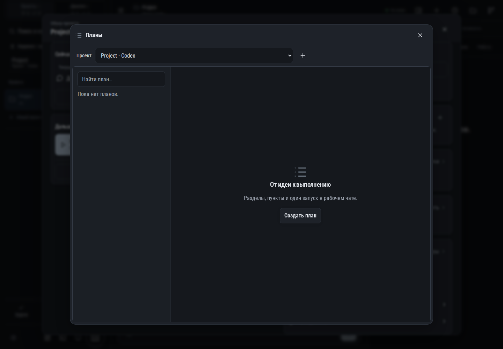

# 293. Планы

**Широкий экран · 1440 × 1000 · тема `classic-dark`.**

Список и редактор планов с пунктами, разделами, контекстом и запуском реализации.

**Как открыть:** Меню → Планы; либо Планы в обзоре проекта.

**Снято после:** Планы. Рабочее состояние.

Вложенное окно поверх сохранённого родительского экрана. Затемнение и видимые края родителя входят в снимок.

**Действия:** «Закрыть рабочий раздел»; «Новый план».

**Поля и параметры:** «Проекты рабочего раздела»; «Найти план».

**Для обсуждения:** Удобно ли редактировать пункты на телефоне? Ясна ли граница между сохранением плана и запуском работы?

Снимок фиксирует вид интерфейса. Данные демонстрационные; ошибки, ожидания и конфликты могли быть созданы сценарием. Это не подтверждение состояния рабочего сервера или реальных интеграций.

**Источник:** [ProjectWork.tsx](../../apps/web/src/ProjectWork.tsx). Сценарий `project-work`; код `56214b0`, 2026-10-02. Chromium; размер окна эмулируется, это не физический iPhone.

[Другой размер](293-phone.md) · [Раздел](README.md) · [Весь каталог](../README.md)
