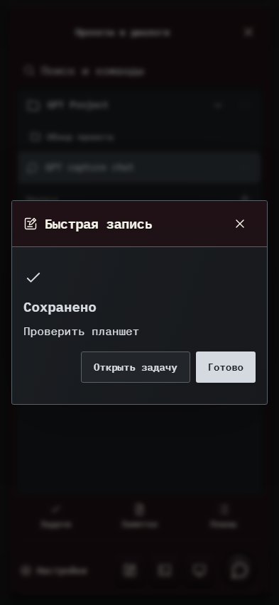

# 302. Быстрая запись

**Телефон · 393 × 852 · тема `crt-green`.**

Быстрая запись идеи, заметки, задачи или другого материала.

**Как открыть:** Кнопка Быстрая запись в меню.

**Снято после:** Сохранить. Рабочее состояние.

Вложенное окно поверх сохранённого родительского экрана. Затемнение и видимые края родителя входят в снимок.

**Действия:** «Закрыть запись»; «Открыть задачу»; «Готово».

**Для обсуждения:** Действительно ли запись быстрая? Какие поля нужны сразу, а какие можно раскрывать позже?

Снимок фиксирует вид интерфейса. Данные демонстрационные; ошибки, ожидания и конфликты могли быть созданы сценарием. Это не подтверждение состояния рабочего сервера или реальных интеграций.

**Источник:** [QuickCapture.tsx](../../apps/web/src/QuickCapture.tsx). Сценарий `quick-capture`; код `56214b0`, 2026-10-02. Chromium; размер окна эмулируется, это не физический iPhone.

[Другой размер](302-desktop.md) · [Раздел](README.md) · [Весь каталог](../README.md)
