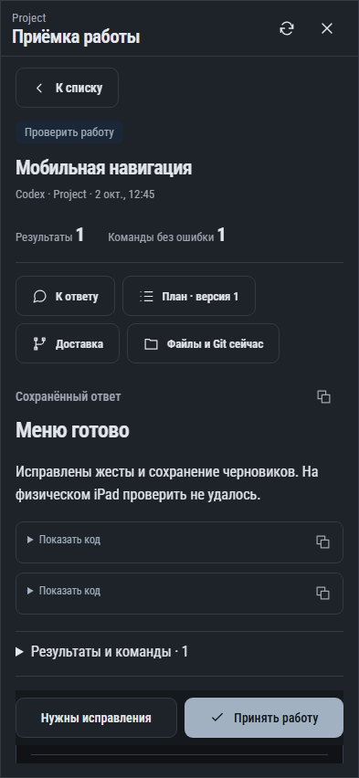

# 304. Приёмка работы

**Телефон · 393 × 852 · тема `classic-dark`.**

Приёмка результата работы, замечания и сопоставление с планом.

**Как открыть:** Карточка результата или раздел приёмок проекта.

**Снято после:** Проверить работу. Сообщение об ошибке или проверке.

**Действия:** «Обновить приёмку»; «Закрыть приёмку»; «К списку»; «К ответу»; «План · версия 1»; «Доставка»; «Файлы и Git сейчас»; «Копировать результат работы»; «Копировать блок»; «Проверка навигации»; «Обновить сверку»; «Отметить выбранные»; «Нужны исправления»; «Принять работу».

**Поля и параметры:** «Исправить меню»; «Сохранить черновики»; «Проверить физический iPad».

**Для обсуждения:** Понятно ли, что означает принятие результата? Достаточно ли контекста для замечаний без переключения окон?

Снимок фиксирует вид интерфейса. Данные демонстрационные; ошибки, ожидания и конфликты могли быть созданы сценарием. Это не подтверждение состояния рабочего сервера или реальных интеграций.

**Источник:** [WorkReview.tsx](../../apps/web/src/WorkReview.tsx). Сценарий `work-review`; код `56214b0`, 2026-10-02. Chromium; размер окна эмулируется, это не физический iPhone.

[Другой размер](304-desktop.md) · [Раздел](README.md) · [Весь каталог](../README.md)
