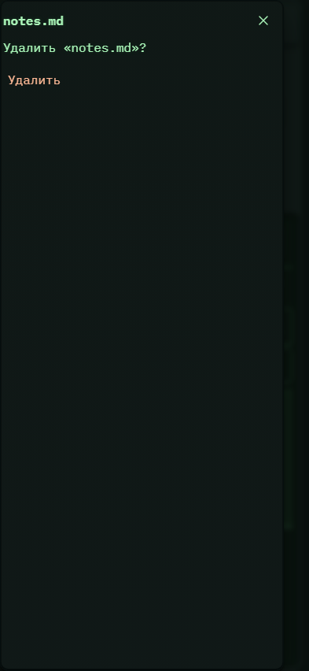

# 318. Действия с файлами

**Телефон · 393 × 852 · тема `crt-green`.**

Создание, переименование, перенос или удаление выбранного файла/папки.

**Как открыть:** Файлы проекта → действие с выбранным объектом.

**Снято после:** Удалить. Рабочее состояние.

Вложенное окно поверх сохранённого родительского экрана. Затемнение и видимые края родителя входят в снимок.

**Действия:** «Закрыть действия с файлом»; «Удалить».

**Для обсуждения:** Хорошо ли видны исходный и целевой пути? Не слишком ли глубоко спрятаны повседневные операции?

Снимок фиксирует вид интерфейса. Данные демонстрационные; ошибки, ожидания и конфликты могли быть созданы сценарием. Это не подтверждение состояния рабочего сервера или реальных интеграций.

**Источник:** [FileManagerActions.tsx](../../apps/web/src/FileManagerActions.tsx). Сценарий `polish-extra.mjs`; код `56214b0`, 2026-10-02. Chromium; размер окна эмулируется, это не физический iPhone.

[Другой размер](318-desktop.md) · [Раздел](README.md) · [Весь каталог](../README.md)
