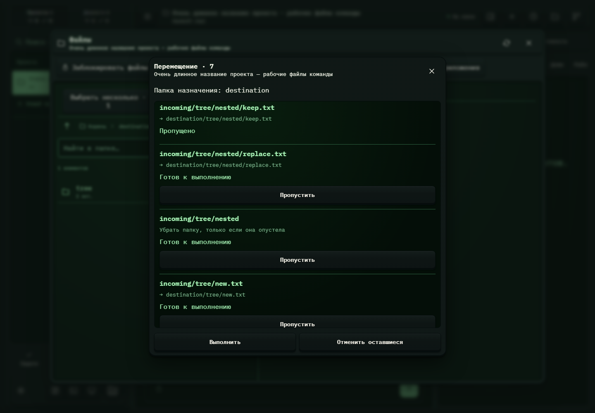

# 332. Групповая операция

**Широкий экран · 1440 × 1000 · тема `crt-green`.**

Групповая операция над файлами либо подготовка ZIP-архива.

**Как открыть:** Выбор нескольких файлов → групповое действие; либо скачать папку архивом.

**Снято после:** Заменить выбранную версию. Рабочее состояние.

Вложенное окно поверх сохранённого родительского экрана. Затемнение и видимые края родителя входят в снимок.

**Действия:** «Закрыть групповую операцию»; «Пропустить»; «Выполнить»; «Отменить оставшиеся».

**Для обсуждения:** Понятны ли состав набора и результат операции? Как яснее представить конфликты имён?

Снимок фиксирует вид интерфейса. Данные демонстрационные; ошибки, ожидания и конфликты могли быть созданы сценарием. Это не подтверждение состояния рабочего сервера или реальных интеграций.

**Источник:** [FileBatchActions.tsx](../../apps/web/src/FileBatchActions.tsx), [ProjectArchiveDownload.tsx](../../apps/web/src/ProjectArchiveDownload.tsx). Сценарий `file-merge`; код `56214b0`, 2026-10-02. Chromium; размер окна эмулируется, это не физический iPhone.

[Другой размер](332-phone.md) · [Раздел](README.md) · [Весь каталог](../README.md)
