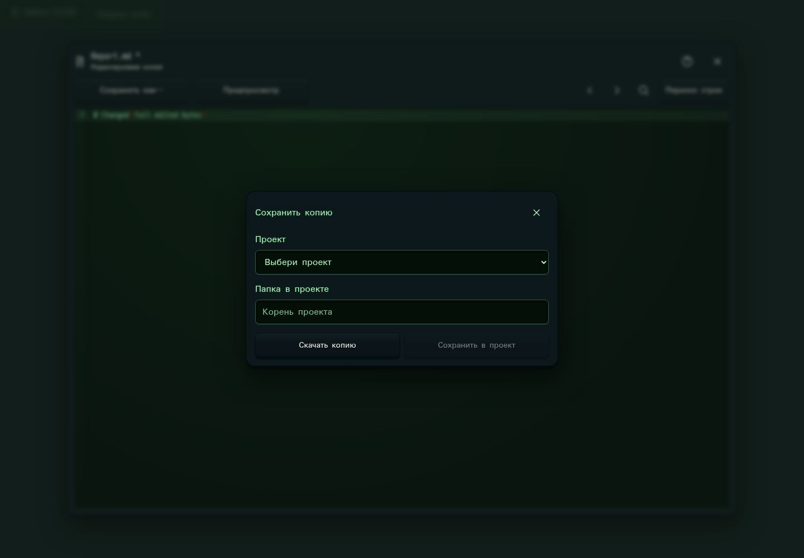

# 336. Сохранить копию

**Широкий экран · 1440 × 1000 · тема `crt-green`.**

Выбор назначения при сохранении редактируемой копии файла.

**Как открыть:** Редактор копии → Сохранить копию.

**Снято после:** Сохранить как…. Рабочее состояние.

Вложенное окно поверх сохранённого родительского экрана. Затемнение и видимые края родителя входят в снимок.

Компонент открыт в изолированном стенде. Демонстрационный фон и кнопки запуска вне окна не являются отдельным экраном продукта.

**Действия:** «Закрыть сохранение копии»; «Сохранить в проект».

**Поля и параметры:** «Проект для копии»; «Папка для копии».

**Для обсуждения:** Ясно ли, что оригинал сохранится? Удобно ли выбрать проект, папку и имя?

Снимок фиксирует вид интерфейса. Данные демонстрационные; ошибки, ожидания и конфликты могли быть созданы сценарием. Это не подтверждение состояния рабочего сервера или реальных интеграций.

**Источник:** [FileCopySave.tsx](../../apps/web/src/FileCopySave.tsx). Сценарий `manual-edit`; код `56214b0`, 2026-10-02. Chromium; размер окна эмулируется, это не физический iPhone.

[Другой размер](336-phone.md) · [Раздел](README.md) · [Весь каталог](../README.md)
