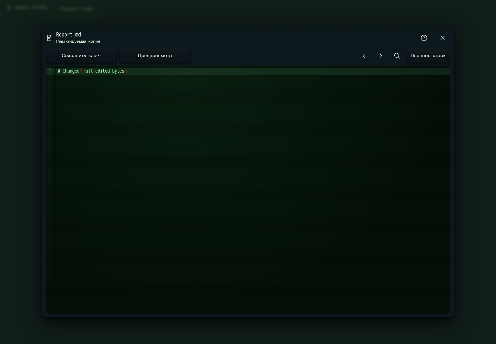

# 345. Редактор Report.md

**Широкий экран · 1440 × 1000 · тема `crt-green`.**

Редактор текста/кода, сохранение изменений и разрешение конфликтов.

**Как открыть:** Просмотр файла → Редактировать / Разблокировать и редактировать.

**Снято после:** Загрузить. Рабочее состояние.

Вложенное окно поверх сохранённого родительского экрана. Затемнение и видимые края родителя входят в снимок.

Компонент открыт в изолированном стенде. Демонстрационный фон и кнопки запуска вне окна не являются отдельным экраном продукта.

**Действия:** «Справка и клавиши»; «Закрыть редактор»; «Сохранить как…»; «Предпросмотр»; «Отменить изменение»; «Повторить изменение»; «Найти в файле»; «Перенос строк».

**Для обсуждения:** Достаточно ли места тексту и панели действий? Можно ли сразу отличить рабочий файл от редактируемой копии?

Снимок фиксирует вид интерфейса. Данные демонстрационные; ошибки, ожидания и конфликты могли быть созданы сценарием. Это не подтверждение состояния рабочего сервера или реальных интеграций.

**Источник:** [FileEditor.tsx](../../apps/web/src/FileEditor.tsx). Сценарий `manual-edit`; код `56214b0`, 2026-10-02. Chromium; размер окна эмулируется, это не физический iPhone.

[Другой размер](345-phone.md) · [Раздел](README.md) · [Весь каталог](../README.md)
