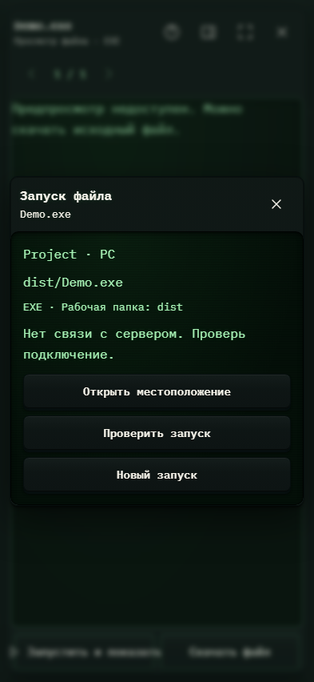

# 347. Запуск файла

**Телефон · 393 × 852 · тема `crt-green`.**

Запуск выбранного файла на связанном компьютере и наблюдение за состоянием.

**Как открыть:** Файлы → Запуск файла.

**Снято после:** Запустить и показать. Сообщение об ошибке или проверке.

Вложенное окно поверх сохранённого родительского экрана. Затемнение и видимые края родителя входят в снимок.

**Действия:** «Закрыть запуск»; «Открыть местоположение»; «Проверить запуск»; «Новый запуск».

**Для обсуждения:** Понятны ли устройство, способ запуска и состояние? Как уменьшить технический шум?

Снимок фиксирует вид интерфейса. Данные демонстрационные; ошибки, ожидания и конфликты могли быть созданы сценарием. Это не подтверждение состояния рабочего сервера или реальных интеграций.

**Источник:** [FileLaunchPanel.tsx](../../apps/web/src/FileLaunchPanel.tsx). Сценарий `file-launch`; код `56214b0`, 2026-10-02. Chromium; размер окна эмулируется, это не физический iPhone.

[Другой размер](347-desktop.md) · [Раздел](README.md) · [Весь каталог](../README.md)
