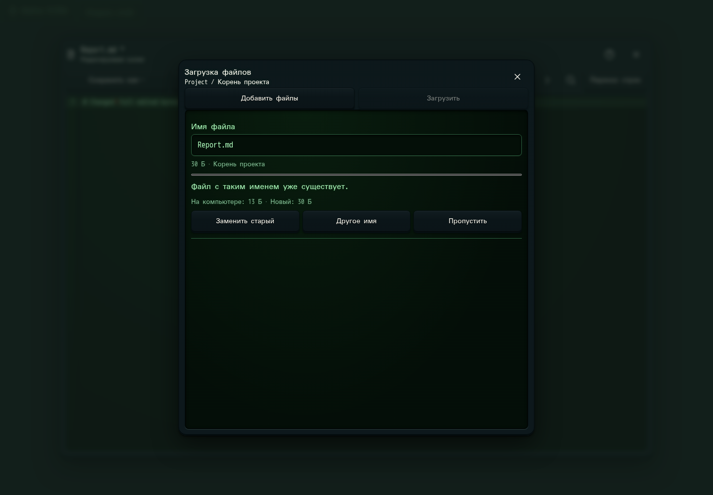

# 348. Загрузка файлов

**Широкий экран · 1440 × 1000 · тема `crt-green`.**

Загрузка файлов в рабочую папку, выбор при совпадении имён и состояние передачи.

**Как открыть:** Файлы проекта → Загрузить файлы.

**Снято после:** Загрузить. Рабочее состояние.

Вложенное окно поверх сохранённого родительского экрана. Затемнение и видимые края родителя входят в снимок.

Компонент открыт в изолированном стенде. Демонстрационный фон и кнопки запуска вне окна не являются отдельным экраном продукта.

**Действия:** «Закрыть загрузку»; «Добавить файлы»; «Загрузить»; «Заменить старый»; «Другое имя»; «Пропустить».

**Поля и параметры:** «Имя: Report.md».

**Для обсуждения:** Удобно ли разбирать совпадения по одному и группой? Достаточно ли ясно, что успешно загружено?

Снимок фиксирует вид интерфейса. Данные демонстрационные; ошибки, ожидания и конфликты могли быть созданы сценарием. Это не подтверждение состояния рабочего сервера или реальных интеграций.

**Источник:** [ProjectFileUpload.tsx](../../apps/web/src/ProjectFileUpload.tsx). Сценарий `manual-edit`; код `56214b0`, 2026-10-02. Chromium; размер окна эмулируется, это не физический iPhone.

[Другой размер](348-phone.md) · [Раздел](README.md) · [Весь каталог](../README.md)
